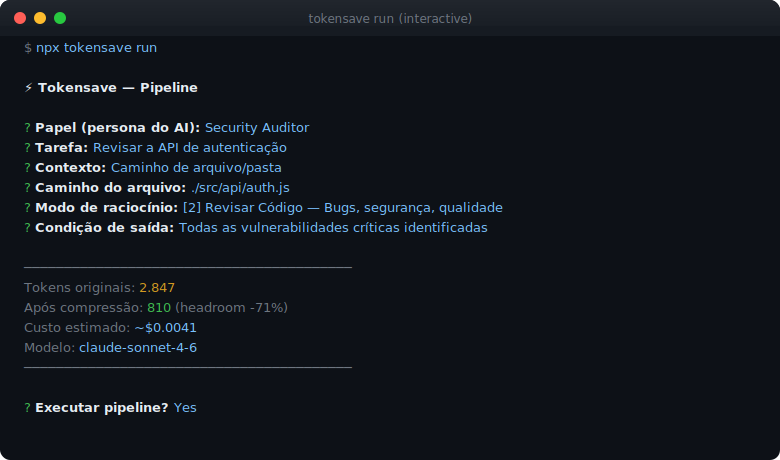
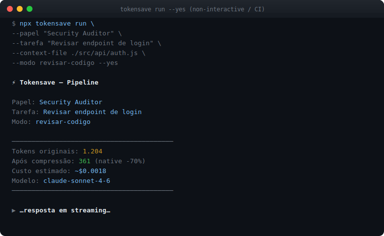
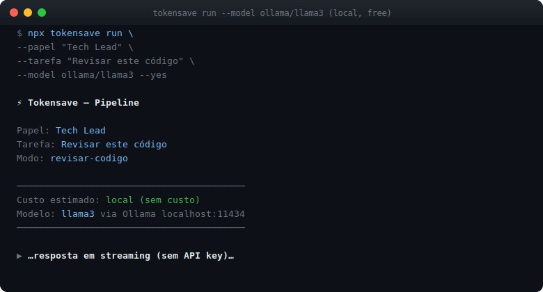

<div align="center">

# ⚡ tokensave

**Structured AI pipeline for any tool. One command. 70% less tokens.**

[](https://www.npmjs.com/package/tokensave)
[](LICENSE)
[](https://nodejs.org)

[🇧🇷 Português](#-português) · [🇺🇸 English](#-english)

</div>

---

## Screenshots

### 1. Comandos disponíveis


---

### 2. Setup — detecta AI tools e injeta Caveman + MCP


---

### 3. Pipeline builder interativo



---

### 4. Resposta em streaming com compressão


---

### 5. Modo não-interativo (scripts / CI)



---

### 6. Skills com encadeamento de modos


---

### 7. Templates — salvar e reusar pipelines


---

### 8. Stats — métricas por projeto


---

### 9. Ollama — modelo local sem API key



---

## 🇧🇷 Português

### O problema

Você usa Claude Code, Cursor, Copilot ou Windsurf todo dia — e provavelmente está desperdiçando a maioria dos tokens que paga.

**No input:** contexto inflado com comentários, linhas em branco, código repetido e texto que não acrescenta nada ao modelo. Tudo isso vai para a API e você paga por cada caractere.

**No output:** o modelo responde com frases de cortesia ("Claro! Fico feliz em ajudar..."), hedging ("pode ser que...", "talvez valha considerar..."), repetição do que já foi dito e parágrafos que poderiam ser uma linha. Você paga pelo ruído, não pela informação.

**Na estrutura:** prompts ad-hoc sem papel definido, sem modo de raciocínio adequado para a tarefa e sem critério de conclusão geram respostas genéricas. Um prompt vago para revisar código produz uma resposta superficial. O mesmo contexto enviado com o papel certo, no modo certo, produz uma análise cirúrgica — com menos tokens.

**O resultado:** custo alto, respostas mediocres, zero visibilidade do que está sendo gasto.

---

### O que é

tokensave resolve os três problemas ao mesmo tempo. É uma CLI que estrutura como você interage com AI: você define **papel → tarefa → contexto → modo de raciocínio → condição de saída**, o sistema comprime o contexto automaticamente, injeta regras de compressão no output, chama a API e streama o resultado no terminal. Cada execução é salva localmente com métricas de tokens e custo real.

**Economia típica: 60–75% nos tokens de entrada + 40–60% nos tokens de saída.**

---

### Instalação

Nenhuma instalação necessária. Requer apenas Node.js 18+.

```bash
npx tokensave
```

---

### Início rápido

```bash
# 1. Configure sua API key (Claude, GPT ou Gemini)
npx tokensave config

# 2. Injeta regras Caveman no Claude Code / Cursor / Copilot / Windsurf
npx tokensave setup

# 3. Execute um pipeline estruturado
npx tokensave run

# 4. Veja quanto economizou
npx tokensave stats
```

---

### Como funciona — lógica completa

O sistema é composto por cinco camadas independentes que se comunicam em sequência:

#### 1. CLI (Commander)

O ponto de entrada é `bin/tokensave.js`, que carrega `src/cli/index.js`. O [Commander](https://github.com/tj/commander.js) registra os subcomandos (`run`, `setup`, `dash`, `skills`, `stats`, `config`). Cada subcomando é um módulo separado em `src/cli/commands/` carregado de forma lazy com `await import()` — isso garante que o processo inicie instantaneamente sem carregar dependências desnecessárias.

#### 2. Pipeline Builder (`src/pipeline/builder.js`)

Quando o usuário executa `tokensave run`, o builder abre um formulário interativo via [Inquirer.js](https://github.com/SBoudrias/Inquirer.js). Os campos coletados são:

- **PAPEL** — a persona que o AI assume (ex: "Security Auditor"). Define o tom e o ponto de vista da resposta.
- **TAREFA** — o objetivo da sessão em linguagem natural.
- **CONTEXTO** — código, arquivo ou texto colado. O builder lê arquivos do disco com `fs.readFileSync` quando o usuário informa um caminho.
- **MODO** — um dos 11 modos de raciocínio. Cada modo é um objeto com `systemPrompt` otimizado, `cavemanLevel` e `papeis` sugeridos.
- **CONDIÇÃO** — critério de conclusão (ex: "Todas as vulnerabilidades críticas identificadas").

O builder retorna um objeto `pipeline` com esses cinco campos, que é passado integralmente para o executor.

#### 3. Compressor (`src/compressor/`)

Antes de chamar a API, o executor comprime o contexto em duas etapas:

**Entrada — Headroom (`headroom.js`):**
Tenta executar o binário `headroom` via `child_process.spawnSync`. O [headroom-ai](https://github.com/outlines-dev/headroom) é um compressor semântico de texto baseado em Python que remove redundâncias mantendo o significado técnico. Se o processo retornar status 0, o texto comprimido é usado. Se falhar (Python não instalado, headroom não encontrado, timeout de 15s), cai no fallback nativo.

**Fallback nativo (`native.js`):**
Compressor puro em JavaScript que:
1. Remove comentários de linha (`//` em JS/TS, `#` em Python) com regex que evita matches dentro de strings
2. Colapsa múltiplas linhas em branco para uma única
3. Remove whitespace trailing por linha
4. Aplica truncamento inteligente se o contexto ultrapassar `maxTokens`: mantém a primeira e última metade, inserindo um marcador `[truncated by tokensave]` no meio

A estimativa de tokens usa a heurística `caracteres / 4`, que corresponde à média empírica do GPT-4 tokenizer para código e texto técnico.

**Saída — Caveman (`caveman.js`):**
Não comprime o contexto enviado — atua no system prompt. Injeta um bloco de regras de escrita no final de cada system prompt que instrui o modelo a responder de forma extremamente compacta. Três níveis:
- `lite` — remove apenas filler words e pleasantries, mantém frases completas
- `full` — fragmentos OK, remove artigos, hedging, sinônimos curtos
- `ultra` — abreviações pesadas, setas para causalidade, mínimo de palavras possível

#### 4. Executor (`src/pipeline/executor.js`)

Com o contexto comprimido e o system prompt montado, o executor:

1. **Detecta o provedor** pelo prefixo do modelo (`claude-*` → Anthropic, `gpt-*` / `o1-*` → OpenAI, `gemini-*` → Google)
2. **Carrega a API key** do arquivo `~/.tokensave/config.json` ou das variáveis de ambiente (`ANTHROPIC_API_KEY`, `OPENAI_API_KEY`, `GOOGLE_API_KEY`)
3. **Monta o `userMessage`** concatenando PAPEL + TAREFA + CONTEXTO comprimido + CONDIÇÃO
4. **Exibe o resumo pré-execução** com tokens originais, tokens após compressão, custo estimado e modelo
5. **Faz streaming** — cada provedor tem seu próprio handler:
   - Anthropic: usa `client.messages.stream()` do `@anthropic-ai/sdk`, itera sobre eventos `content_block_delta`
   - OpenAI: usa `client.chat.completions.create({ stream: true })` do `openai`, itera sobre `choices[0].delta.content`
   - Google: usa `genModel.generateContentStream()` do `@google/generative-ai`, itera sobre `chunk.text()`
6. **Persiste métricas** no SQLite via `createStore()` — salva papel, tarefa, modo, modelo, tokens in/out, custo e duração

#### 5. Store (`src/store/db.js`)

Usa [better-sqlite3](https://github.com/WiseLibs/better-sqlite3) para armazenar o histórico em `~/.tokensave/metrics.db`. O banco é criado automaticamente na primeira execução com `CREATE TABLE IF NOT EXISTS`. As queries usam prepared statements para performance. Métodos expostos: `saveRun`, `getRecentRuns`, `getSummary`, `getTodaySummary`, `getModeStats`.

#### 6. Dashboard

**Terminal (`src/dashboard/tui.js`):** Usa `process.stdin.setRawMode(true)` para capturar teclas sem Enter. Renderiza uma tabela ASCII com chalk. Teclas: `r` refresh, `h` histórico, `w` abre browser, `q` sai.

**Web (`src/dashboard/web/`):** O [Hono](https://github.com/honojs/hono) serve três endpoints REST (`/api/summary`, `/api/runs`, `/api/runs/export.csv`) e o HTML estático. O `index.html` é 100% vanilla — `fetch` + DOM — sem bundler, sem framework. Atualiza automaticamente a cada 30 segundos.

#### 7. Setup e Injeção (`src/detector/` + `src/injector/`)

O detector usa `fs.existsSync` em caminhos conhecidos para identificar quais tools estão instalados. Cada injector lê o arquivo de configuração do tool, verifica se o marcador `TOKENSAVE` já existe (evita duplicação em execuções repetidas) e escreve as regras Caveman na posição correta do arquivo.

#### 8. Skills (`skills/index.js`)

Bundles de domínio que pré-configuram papel, modos disponíveis e condição de saída padrão. O menu de skills chama o builder com `modeOverride` já definido, permitindo ao usuário pular direto para o modo correto para aquele domínio.

---

### Fluxo de dados

```
npx tokensave run
       │
       ▼
  [CLI / Commander]
  registra subcomandos, lazy-load por await import()
       │
       ▼
  [Pipeline Builder / Inquirer]
  coleta: papel, tarefa, contexto, modo, condição
       │
       ▼
  [Compressor]
  ┌─ headroom (Python subprocess, 15s timeout)
  │    └─ spawnSync('headroom', ['compress', '--stdin'])
  └─ fallback nativo (JS puro)
       ├─ remove comentários (regex)
       ├─ colapsa blank lines
       └─ truncamento inteligente se > maxTokens
       │
       ▼
  [Caveman / system prompt]
  getSystemSuffix(cavemanLevel) → injeta regras no final do systemPrompt do modo
       │
       ▼
  [Executor]
  ├─ detecta provedor pelo prefixo do modelo
  ├─ exibe resumo pré-execução (tokens, custo estimado)
  ├─ stream → Anthropic | OpenAI | Google
  │    └─ escreve chunks em process.stdout conforme chegam
  └─ salva métricas no SQLite
       │
       ▼
  [Dashboard]
  ├─ TUI: chalk + raw stdin
  └─ Web: Hono + HTML vanilla + fetch polling 30s
```

---

### Estrutura do projeto

```
tokensave/
├── bin/
│   └── tokensave.js              ← entry point npx
├── src/
│   ├── cli/
│   │   ├── index.js              ← comandos Commander (run/setup/dash/skills/stats/config)
│   │   └── commands/
│   │       ├── run.js            ← inicia o pipeline builder + executor
│   │       ├── setup.js          ← detecta tools e injeta configs
│   │       ├── dash.js           ← TUI ou web dashboard
│   │       ├── skills.js         ← menu de bundles por domínio
│   │       ├── stats.js          ← resumo rápido no terminal
│   │       └── config.js         ← API keys e modelo padrão
│   ├── pipeline/
│   │   ├── builder.js            ← fluxo interativo com Inquirer
│   │   ├── executor.js           ← chama API, streama, salva métricas
│   │   └── modes/
│   │       ├── index.js          ← getModeById, getModeChoices, MODES[]
│   │       ├── criar-sistema.js  ← arquitetura do zero
│   │       ├── revisar-codigo.js ← bugs, segurança, qualidade
│   │       ├── documentacao.js   ← README, ADR, JSDoc
│   │       ├── consultor.js      ← ROI, risco, decisão C-level
│   │       ├── swot.js           ← análise estratégica
│   │       ├── compare.js        ← A vs B com critérios
│   │       ├── multi-perspectiva.js ← Dev + PM + User + Ops
│   │       ├── parallel-lens.js  ← 3 abordagens + matriz de decisão
│   │       ├── pitfalls.js       ← o que pode dar errado
│   │       ├── metrics-mode.js   ← KPIs e instrumentação
│   │       └── context-stack.js  ← contexto progressivo em camadas
│   ├── compressor/
│   │   ├── headroom.js           ← subprocess Python headroom-ai
│   │   ├── native.js             ← compressão leve sem Python
│   │   └── caveman.js            ← regras Caveman nos system prompts
│   ├── detector/
│   │   └── index.js              ← detecta Claude Code, Cursor, Copilot, Windsurf
│   ├── injector/
│   │   ├── claude-code.js        ← customInstructions em ~/.claude/settings.json
│   │   ├── cursor.js             ← cursor.rules em Cursor/settings.json
│   │   ├── copilot.js            ← .github/copilot-instructions.md
│   │   └── windsurf.js           ← ~/.codeium/windsurf/.windsurfrc
│   ├── dashboard/
│   │   ├── tui.js                ← dashboard terminal (keyboard-driven)
│   │   └── web/
│   │       ├── server.js         ← Hono HTTP server + REST API
│   │       └── index.html        ← dashboard web (HTML + JS vanilla)
│   └── store/
│       └── db.js                 ← better-sqlite3, histórico de sessões
├── skills/
│   └── index.js                  ← 8 bundles: Security Audit, DevOps, etc.
└── tests/                        ← 35 testes (vitest)
```

---

### Comandos

| Comando | Descrição |
|---------|-----------|
| `npx tokensave run` | Pipeline builder interativo |
| `npx tokensave run --mode swot` | Pula menu, vai direto para o modo |
| `npx tokensave run --papel "..." --tarefa "..." --modo pitfalls --yes` | Modo não-interativo (scripts/CI) |
| `npx tokensave run --context-url https://...` | Usa URL como contexto |
| `npx tokensave run --model ollama/llama3` | Modelo local via Ollama (sem API key) |
| `npx tokensave run --save-as minha-revisao` | Salva pipeline como template |
| `npx tokensave run --template minha-revisao` | Carrega template salvo |
| `npx tokensave templates` | Lista e gerencia templates salvos |
| `npx tokensave setup` | Detecta AI tools, injeta Caveman + MCP server |
| `npx tokensave skills` | Menu de bundles por domínio (com encadeamento) |
| `npx tokensave dash` | Dashboard terminal |
| `npx tokensave dash --web` | Dashboard web em localhost:7878 |
| `npx tokensave stats` | Resumo de tokens economizados por projeto |
| `npx tokensave config` | Configura API keys e modelo padrão |
| `npx tokensave mcp` | Inicia o MCP server de compressão (stdio) |

---

### Modo não-interativo

Útil em scripts, CI e automações:

```bash
# Executa sem nenhum prompt
npx tokensave run \
  --papel "Security Auditor" \
  --tarefa "Revisar este endpoint para vulnerabilidades" \
  --context-file ./src/api/auth.js \
  --modo revisar-codigo \
  --condicao "Todos os issues críticos identificados" \
  --yes

# Com URL como contexto
npx tokensave run \
  --papel "Tech Lead" \
  --tarefa "Resumir as mudanças desta PR" \
  --context-url https://github.com/org/repo/pull/42 \
  --modo consultor \
  --yes

# Modelo local sem API key
npx tokensave run --modelo "Tech Lead" --tarefa "Revisar o código" \
  --model ollama/llama3 --modo revisar-codigo --yes
```

---

### Templates

Salve configurações de pipeline para reusar:

```bash
# Salvar
npx tokensave run --save-as security-weekly

# Reusar (preenche papel, modo e condição automaticamente)
npx tokensave run --template security-weekly

# Listar
npx tokensave templates

# Remover
npx tokensave templates --delete security-weekly
```

---

### Ollama (modelos locais)

Sem API key, sem custo por token:

```bash
# Qualquer modelo disponível no Ollama local
npx tokensave run --model ollama/llama3
npx tokensave run --model ollama/codellama
npx tokensave run --model ollama/mistral

# URL base customizada (padrão: http://localhost:11434/v1)
npx tokensave config  # → definir ollama_base_url
```

---

### MCP Server

O tokensave expõe um MCP server que o Claude Code usa para comprimir contexto automaticamente antes de cada chamada de API:

```bash
# Instalado automaticamente pelo setup no ~/.claude/settings.json
npx tokensave setup

# Ou iniciar manualmente
npx tokensave mcp
```

A ferramenta exposta é `compress_context` — recebe texto, retorna versão comprimida com tokens originais, comprimidos e método usado.

---

### Modos de raciocínio

| # | Modo | O que faz | Caveman |
|---|------|-----------|---------|
| 1 | Criar Sistema | Arquitetura do zero: stack, estrutura, decisões | full |
| 2 | Revisar Código | Bugs, segurança, qualidade, code smell | full |
| 3 | Documentação | README, ADR, changelog, JSDoc | lite |
| 4 | Consultor | ROI, risco, decisão como C-level | full |
| 5 | SWOT | Forças, fraquezas, oportunidades, ameaças | full |
| 6 | Compare | A vs B com critérios explícitos | full |
| 7 | Multi-perspectiva | Dev + PM + User + Ops | full |
| 8 | Parallel Lens | 3 abordagens simultâneas + matriz de decisão | ultra |
| 9 | Pitfalls | O que pode dar errado, armadilhas, edge cases | full |
| 10 | Metrics Mode | Define e mede KPIs | full |
| 11 | Context Stack | Contexto progressivo sem explodir tokens | full |

---

### Skills — Bundles por domínio

| Bundle | Papel padrão | Modos |
|--------|-------------|-------|
| Security Audit | Security Auditor | Revisar Código + Pitfalls + Multi-perspectiva |
| Data Science | Data Scientist | Metrics Mode + Criar Sistema + Compare |
| Database | DBA | Criar Sistema + Revisar Código + Pitfalls |
| Software Architect | Arquiteto Sênior | Criar Sistema + Compare + Multi-perspectiva |
| UX/UI | UX Researcher | Multi-perspectiva + Consultor + Pitfalls |
| DevOps | SRE | Criar Sistema + Metrics Mode + Pitfalls |
| Code Review | Tech Lead | Revisar Código + Pitfalls + Consultor |
| Documentation | Technical Writer | Documentação + Context Stack |

---

### Modelos suportados

| Provedor | Modelos | Variável de ambiente |
|----------|---------|---------------------|
| Anthropic | claude-sonnet-4-6, claude-haiku-4-5 | `ANTHROPIC_API_KEY` |
| OpenAI | gpt-4o, gpt-4o-mini | `OPENAI_API_KEY` |
| Google | gemini-1.5-pro, gemini-1.5-flash | `GOOGLE_API_KEY` |

---

### Créditos e dependências

Este projeto é construído sobre o trabalho de projetos open source incríveis:

| Pacote | Uso no tokensave | Repositório |
|--------|-----------------|-------------|
| [Commander.js](https://github.com/tj/commander.js) | Parser de subcomandos e flags da CLI | `tj/commander.js` |
| [Inquirer.js](https://github.com/SBoudrias/Inquirer.js) | Formulário interativo do pipeline builder | `SBoudrias/Inquirer.js` |
| [Chalk](https://github.com/chalk/chalk) | Cores e formatação no terminal | `chalk/chalk` |
| [Hono](https://github.com/honojs/hono) | Web framework do dashboard — leve, zero-deps | `honojs/hono` |
| [@hono/node-server](https://github.com/honojs/node-server) | Adapter Node.js para o Hono | `honojs/node-server` |
| [better-sqlite3](https://github.com/WiseLibs/better-sqlite3) | Banco SQLite local para histórico de métricas | `WiseLibs/better-sqlite3` |
| [@anthropic-ai/sdk](https://github.com/anthropic-ai/anthropic-sdk-node) | Client oficial Anthropic com streaming | `anthropic-ai/anthropic-sdk-node` |
| [openai](https://github.com/openai/openai-node) | Client oficial OpenAI com streaming | `openai/openai-node` |
| [@google/generative-ai](https://github.com/google-gemini/generative-ai-js) | Client oficial Google Gemini | `google-gemini/generative-ai-js` |
| [open](https://github.com/sindresorhus/open) | Abre o dashboard no browser | `sindresorhus/open` |
| [headroom-ai](https://github.com/outlines-dev/headroom) | Compressor semântico de contexto (Python) | `outlines-dev/headroom` |
| [vitest](https://github.com/vitest-dev/vitest) | Test runner (35 testes) | `vitest-dev/vitest` |

---

### Requisitos

- Node.js 18+
- API key de pelo menos um provedor (Anthropic, OpenAI ou Google)
- Python 3.10+ com `headroom-ai` para compressão máxima (opcional)

---

### Licença

MIT © [Diego Lial](https://github.com/DiegoLial)

---

---

## 🇺🇸 English

### The problem

You use Claude Code, Cursor, Copilot, or Windsurf every day — and you're probably wasting most of the tokens you're paying for.

**On the input side:** bloated context full of comments, blank lines, repeated code, and text that adds no signal for the model. All of it goes to the API, and you pay for every character.

**On the output side:** the model responds with pleasantries ("Sure! I'd be happy to help..."), hedging ("it might be worth considering...", "you could potentially..."), repetition of what was already said, and paragraphs that could be a single line. You pay for the noise, not the information.

**On the structure side:** ad-hoc prompts with no defined role, no reasoning mode matched to the task, and no exit condition produce generic responses. A vague prompt to review code produces a shallow answer. The same context sent with the right role, in the right mode, produces a surgical analysis — with fewer tokens.

**The result:** high cost, mediocre responses, and zero visibility into what's being spent.

---

### What it is

tokensave solves all three problems at once. It's a CLI that structures how you interact with AI: you define **role → task → context → reasoning mode → exit condition** — the system auto-compresses the context, injects output compression rules, calls the API, and streams the result to your terminal. Every run is saved locally with token and cost metrics.

**Typical savings: 60–75% on input tokens + 40–60% on output tokens.**

---

### Installation

No installation needed. Requires Node.js 18+ only.

```bash
npx tokensave
```

---

### Quickstart

```bash
# 1. Set your API key (Claude, GPT, or Gemini)
npx tokensave config

# 2. Inject Caveman rules into Claude Code / Cursor / Copilot / Windsurf
npx tokensave setup

# 3. Run a structured pipeline
npx tokensave run

# 4. Check your savings
npx tokensave stats
```

---

### How it works — full logic

The system is composed of five independent layers that communicate in sequence:

#### 1. CLI (Commander)

The entry point is `bin/tokensave.js`, which loads `src/cli/index.js`. [Commander](https://github.com/tj/commander.js) registers subcommands (`run`, `setup`, `dash`, `skills`, `stats`, `config`). Each subcommand is a separate module in `src/cli/commands/` loaded lazily via `await import()` — this ensures the process starts instantly without loading unnecessary dependencies.

#### 2. Pipeline Builder (`src/pipeline/builder.js`)

When the user runs `tokensave run`, the builder opens an interactive form via [Inquirer.js](https://github.com/SBoudrias/Inquirer.js). The collected fields are:

- **ROLE** — the persona the AI assumes (e.g. "Security Auditor"). Sets the tone and perspective of the response.
- **TASK** — the session objective in natural language.
- **CONTEXT** — code, file, or pasted text. The builder reads files from disk with `fs.readFileSync` when the user provides a path.
- **MODE** — one of 11 reasoning modes. Each mode is an object with an optimized `systemPrompt`, `cavemanLevel`, and suggested `papeis`.
- **CONDITION** — done-when criteria (e.g. "All critical vulnerabilities identified").

The builder returns a `pipeline` object with these five fields, passed in full to the executor.

#### 3. Compressor (`src/compressor/`)

Before calling the API, the executor compresses the context in two stages:

**Input — Headroom (`headroom.js`):**
Attempts to run the `headroom` binary via `child_process.spawnSync`. [headroom-ai](https://github.com/outlines-dev/headroom) is a Python-based semantic text compressor that removes redundancy while preserving technical meaning. If the process returns status 0, the compressed text is used. If it fails (Python not installed, headroom not found, 15s timeout), falls back to native compression.

**Native fallback (`native.js`):**
Pure JavaScript compressor that:
1. Removes line comments (`//` in JS/TS, `#` in Python) with regex that avoids matching inside strings
2. Collapses multiple blank lines into one
3. Removes trailing whitespace per line
4. Applies smart truncation if context exceeds `maxTokens`: keeps the first and last half, inserting a `[truncated by tokensave]` marker in the middle

Token estimation uses the `characters / 4` heuristic, which matches the empirical average of the GPT-4 tokenizer for code and technical text.

**Output — Caveman (`caveman.js`):**
Does not compress the sent context — it operates on the system prompt. Injects a writing rules block at the end of every mode's system prompt, instructing the model to respond in an extremely compact way. Three levels:
- `lite` — removes only filler words and pleasantries, keeps full sentences
- `full` — fragments OK, removes articles, hedging, uses short synonyms
- `ultra` — heavy abbreviations, arrows for causality, minimum possible words

#### 4. Executor (`src/pipeline/executor.js`)

With the compressed context and assembled system prompt, the executor:

1. **Detects the provider** by model prefix (`claude-*` → Anthropic, `gpt-*` / `o1-*` → OpenAI, `gemini-*` → Google)
2. **Loads the API key** from `~/.tokensave/config.json` or environment variables (`ANTHROPIC_API_KEY`, `OPENAI_API_KEY`, `GOOGLE_API_KEY`)
3. **Assembles the `userMessage`** concatenating ROLE + TASK + compressed CONTEXT + CONDITION
4. **Shows the pre-execution summary** with original tokens, post-compression tokens, estimated cost, and model
5. **Streams output** — each provider has its own handler:
   - Anthropic: uses `client.messages.stream()` from `@anthropic-ai/sdk`, iterates over `content_block_delta` events
   - OpenAI: uses `client.chat.completions.create({ stream: true })` from `openai`, iterates over `choices[0].delta.content`
   - Google: uses `genModel.generateContentStream()` from `@google/generative-ai`, iterates over `chunk.text()`
6. **Persists metrics** to SQLite via `createStore()` — saves role, task, mode, model, tokens in/out, cost, and duration

#### 5. Store (`src/store/db.js`)

Uses [better-sqlite3](https://github.com/WiseLibs/better-sqlite3) to store run history in `~/.tokensave/metrics.db`. The database is auto-created on first run via `CREATE TABLE IF NOT EXISTS`. Queries use prepared statements for performance. Exposed methods: `saveRun`, `getRecentRuns`, `getSummary`, `getTodaySummary`, `getModeStats`.

#### 6. Dashboard

**Terminal (`src/dashboard/tui.js`):** Uses `process.stdin.setRawMode(true)` to capture keystrokes without Enter. Renders an ASCII table with chalk. Keys: `r` refresh, `h` history, `w` open browser, `q` quit.

**Web (`src/dashboard/web/`):** [Hono](https://github.com/honojs/hono) serves three REST endpoints (`/api/summary`, `/api/runs`, `/api/runs/export.csv`) and the static HTML. `index.html` is 100% vanilla — `fetch` + DOM — no bundler, no framework. Auto-refreshes every 30 seconds.

#### 7. Setup & Injection (`src/detector/` + `src/injector/`)

The detector uses `fs.existsSync` on known paths to identify which tools are installed. Each injector reads the tool's config file, checks whether the `TOKENSAVE` marker already exists (prevents duplication on repeated runs), and writes the Caveman rules at the correct position in the file.

#### 8. Skills (`skills/index.js`)

Domain bundles that pre-configure role, available modes, and default exit condition. The skills menu calls the builder with `modeOverride` already set, letting the user skip straight to the right mode for that domain.

---

### Data flow

```
npx tokensave run
       │
       ▼
  [CLI / Commander]
  registers subcommands, lazy-load via await import()
       │
       ▼
  [Pipeline Builder / Inquirer]
  collects: role, task, context, mode, condition
       │
       ▼
  [Compressor]
  ┌─ headroom (Python subprocess, 15s timeout)
  │    └─ spawnSync('headroom', ['compress', '--stdin'])
  └─ native fallback (pure JS)
       ├─ remove comments (regex)
       ├─ collapse blank lines
       └─ smart truncation if > maxTokens
       │
       ▼
  [Caveman / system prompt]
  getSystemSuffix(cavemanLevel) → appends rules to mode's systemPrompt
       │
       ▼
  [Executor]
  ├─ detect provider by model prefix
  ├─ show pre-execution summary (tokens, estimated cost)
  ├─ stream → Anthropic | OpenAI | Google
  │    └─ writes chunks to process.stdout as they arrive
  └─ save metrics to SQLite
       │
       ▼
  [Dashboard]
  ├─ TUI: chalk + raw stdin
  └─ Web: Hono + vanilla HTML + fetch polling 30s
```

---

### Project structure

```
tokensave/
├── bin/
│   └── tokensave.js              ← npx entry point
├── src/
│   ├── cli/
│   │   ├── index.js              ← Commander commands (run/setup/dash/skills/stats/config)
│   │   └── commands/
│   │       ├── run.js            ← starts pipeline builder + executor
│   │       ├── setup.js          ← detects tools and injects configs
│   │       ├── dash.js           ← TUI or web dashboard
│   │       ├── skills.js         ← domain bundle menu
│   │       ├── stats.js          ← quick terminal summary
│   │       └── config.js         ← API keys and default model
│   ├── pipeline/
│   │   ├── builder.js            ← interactive flow with Inquirer
│   │   ├── executor.js           ← calls API, streams, saves metrics
│   │   └── modes/
│   │       ├── index.js          ← getModeById, getModeChoices, MODES[]
│   │       ├── criar-sistema.js  ← architecture from scratch
│   │       ├── revisar-codigo.js ← bugs, security, quality
│   │       ├── documentacao.js   ← README, ADR, JSDoc
│   │       ├── consultor.js      ← ROI, risk, C-level decision
│   │       ├── swot.js           ← strategic analysis
│   │       ├── compare.js        ← A vs B with criteria
│   │       ├── multi-perspectiva.js ← Dev + PM + User + Ops
│   │       ├── parallel-lens.js  ← 3 approaches + decision matrix
│   │       ├── pitfalls.js       ← what can go wrong
│   │       ├── metrics-mode.js   ← KPIs and instrumentation
│   │       └── context-stack.js  ← progressive context in layers
│   ├── compressor/
│   │   ├── headroom.js           ← Python headroom-ai subprocess
│   │   ├── native.js             ← lightweight compression, no Python
│   │   └── caveman.js            ← Caveman rules in system prompts
│   ├── detector/
│   │   └── index.js              ← detects Claude Code, Cursor, Copilot, Windsurf
│   ├── injector/
│   │   ├── claude-code.js        ← customInstructions in ~/.claude/settings.json
│   │   ├── cursor.js             ← cursor.rules in Cursor/settings.json
│   │   ├── copilot.js            ← .github/copilot-instructions.md
│   │   └── windsurf.js           ← ~/.codeium/windsurf/.windsurfrc
│   ├── dashboard/
│   │   ├── tui.js                ← terminal dashboard (keyboard-driven)
│   │   └── web/
│   │       ├── server.js         ← Hono HTTP server + REST API
│   │       └── index.html        ← web dashboard (vanilla HTML + JS)
│   └── store/
│       └── db.js                 ← better-sqlite3, run history
├── skills/
│   └── index.js                  ← 8 bundles: Security Audit, DevOps, etc.
└── tests/                        ← 35 tests (vitest)
```

---

### Commands

| Command | Description |
|---------|-------------|
| `npx tokensave run` | Interactive pipeline builder |
| `npx tokensave run --mode swot` | Skip menu, jump to a specific mode |
| `npx tokensave run --papel "..." --tarefa "..." --modo pitfalls --yes` | Non-interactive mode (scripts/CI) |
| `npx tokensave run --context-url https://...` | Fetch URL as context |
| `npx tokensave run --model ollama/llama3` | Local model via Ollama (no API key needed) |
| `npx tokensave run --save-as my-review` | Save pipeline as a named template |
| `npx tokensave run --template my-review` | Load a saved template |
| `npx tokensave templates` | List and manage saved templates |
| `npx tokensave setup` | Detect AI tools, inject Caveman + MCP server |
| `npx tokensave skills` | Domain skill bundle menu (with chaining) |
| `npx tokensave dash` | Terminal dashboard |
| `npx tokensave dash --web` | Web dashboard at localhost:7878 |
| `npx tokensave stats` | Token savings summary per project |
| `npx tokensave config` | Set API keys and default model |
| `npx tokensave mcp` | Start the compression MCP server (stdio) |

---

### Non-interactive mode

Useful in scripts, CI pipelines, and automation:

```bash
# No prompts — executes immediately
npx tokensave run \
  --papel "Security Auditor" \
  --tarefa "Review this endpoint for vulnerabilities" \
  --context-file ./src/api/auth.js \
  --modo revisar-codigo \
  --condicao "All critical issues identified" \
  --yes

# With URL as context
npx tokensave run \
  --papel "Tech Lead" \
  --tarefa "Summarize the changes in this PR" \
  --context-url https://github.com/org/repo/pull/42 \
  --modo consultor \
  --yes
```

---

### Templates

Save pipeline configurations to reuse:

```bash
# Save
npx tokensave run --save-as security-weekly

# Reuse (pre-fills role, mode, and condition)
npx tokensave run --template security-weekly

# List all
npx tokensave templates

# Delete
npx tokensave templates --delete security-weekly
```

---

### Ollama (local models)

No API key, no per-token cost:

```bash
npx tokensave run --model ollama/llama3
npx tokensave run --model ollama/codellama
npx tokensave run --model ollama/mistral
```

Requires Ollama running locally at `http://localhost:11434`. Configure a custom base URL via `tokensave config`.

---

### MCP Server

tokensave exposes an MCP server that Claude Code uses to automatically compress context before each API call:

```bash
# Auto-registered in ~/.claude/settings.json by setup
npx tokensave setup

# Start manually
npx tokensave mcp
```

Exposes the `compress_context` tool — takes text, returns compressed version with token counts and compression method.

---

### Reasoning modes

| # | Mode | What it does | Caveman |
|---|------|-------------|---------|
| 1 | Criar Sistema | Architecture from scratch: stack, structure, decisions | full |
| 2 | Revisar Código | Bugs, security, quality, code smell | full |
| 3 | Documentação | README, ADR, changelog, JSDoc | lite |
| 4 | Consultor | ROI, risk, decisions as C-level | full |
| 5 | SWOT | Strengths, weaknesses, opportunities, threats | full |
| 6 | Compare | A vs B with explicit criteria | full |
| 7 | Multi-perspectiva | Dev + PM + User + Ops angles | full |
| 8 | Parallel Lens | 3 independent approaches + decision matrix | ultra |
| 9 | Pitfalls | What can go wrong, traps, edge cases | full |
| 10 | Metrics Mode | Define and measure KPIs | full |
| 11 | Context Stack | Progressive context without token explosion | full |

---

### Skills — Domain bundles

| Bundle | Default Role | Modes |
|--------|-------------|-------|
| Security Audit | Security Auditor | Revisar Código + Pitfalls + Multi-perspectiva |
| Data Science | Data Scientist | Metrics Mode + Criar Sistema + Compare |
| Database | DBA | Criar Sistema + Revisar Código + Pitfalls |
| Software Architect | Senior Architect | Criar Sistema + Compare + Multi-perspectiva |
| UX/UI | UX Researcher | Multi-perspectiva + Consultor + Pitfalls |
| DevOps | SRE | Criar Sistema + Metrics Mode + Pitfalls |
| Code Review | Tech Lead | Revisar Código + Pitfalls + Consultor |
| Documentation | Technical Writer | Documentação + Context Stack |

---

### Supported models

| Provider | Models | Env var |
|----------|--------|---------|
| Anthropic | claude-sonnet-4-6, claude-haiku-4-5 | `ANTHROPIC_API_KEY` |
| OpenAI | gpt-4o, gpt-4o-mini | `OPENAI_API_KEY` |
| Google | gemini-1.5-pro, gemini-1.5-flash | `GOOGLE_API_KEY` |

---

### Credits & dependencies

This project is built on top of incredible open source work:

| Package | How it's used | Repository |
|---------|--------------|------------|
| [Commander.js](https://github.com/tj/commander.js) | CLI subcommand parser and flag handling | `tj/commander.js` |
| [Inquirer.js](https://github.com/SBoudrias/Inquirer.js) | Interactive pipeline builder form | `SBoudrias/Inquirer.js` |
| [Chalk](https://github.com/chalk/chalk) | Terminal colors and formatting | `chalk/chalk` |
| [Hono](https://github.com/honojs/hono) | Dashboard web framework — lightweight, zero-deps | `honojs/hono` |
| [@hono/node-server](https://github.com/honojs/node-server) | Node.js adapter for Hono | `honojs/node-server` |
| [better-sqlite3](https://github.com/WiseLibs/better-sqlite3) | Local SQLite for metrics history | `WiseLibs/better-sqlite3` |
| [@anthropic-ai/sdk](https://github.com/anthropic-ai/anthropic-sdk-node) | Official Anthropic client with streaming | `anthropic-ai/anthropic-sdk-node` |
| [openai](https://github.com/openai/openai-node) | Official OpenAI client with streaming | `openai/openai-node` |
| [@google/generative-ai](https://github.com/google-gemini/generative-ai-js) | Official Google Gemini client | `google-gemini/generative-ai-js` |
| [open](https://github.com/sindresorhus/open) | Opens the dashboard in the browser | `sindresorhus/open` |
| [headroom-ai](https://github.com/outlines-dev/headroom) | Semantic context compressor (Python) | `outlines-dev/headroom` |
| [vitest](https://github.com/vitest-dev/vitest) | Test runner (35 tests) | `vitest-dev/vitest` |

---

### Requirements

- Node.js 18+
- API key for at least one provider (Anthropic, OpenAI, or Google)
- Python 3.10+ with `headroom-ai` for maximum compression (optional)

---

### License

MIT © [Diego Lial](https://github.com/DiegoLial)
