<div align="center">

# ⚡ tokensave

### Pipeline estruturado de AI. Um comando. 70% menos tokens.

[](https://www.npmjs.com/package/tokensave)
[](LICENSE)
[](https://nodejs.org)
[](#testes)
[](package.json)

[🇧🇷 Português](#-português) · [🇺🇸 English](#-english)

</div>

---

<div align="center">

**Você está pagando por tokens de ruído.**  
Comentários, linhas em branco, frases de cortesia, hedging — tudo vai para a API.  
tokensave elimina isso em duas camadas: **input** e **output**.

</div>

---

## Screenshots

### `tokensave --help`
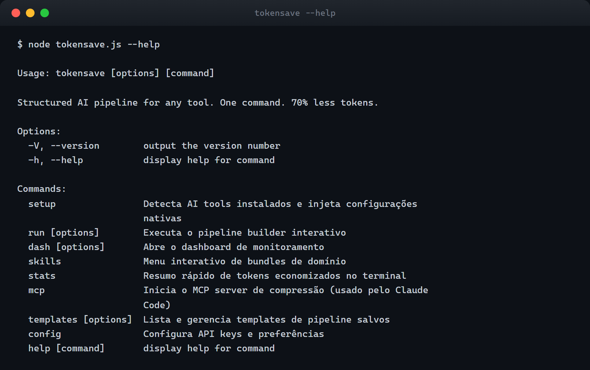

### `tokensave stats` — visibilidade total de custo
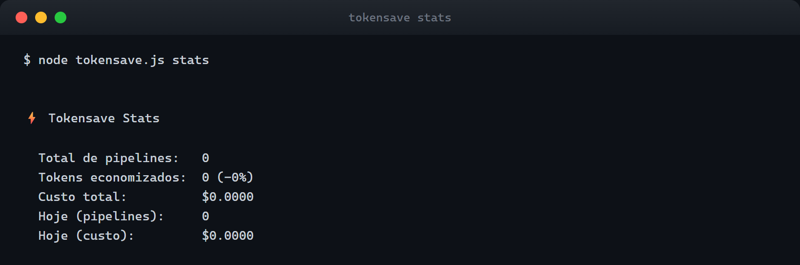

### `tokensave run --help` — modo não-interativo
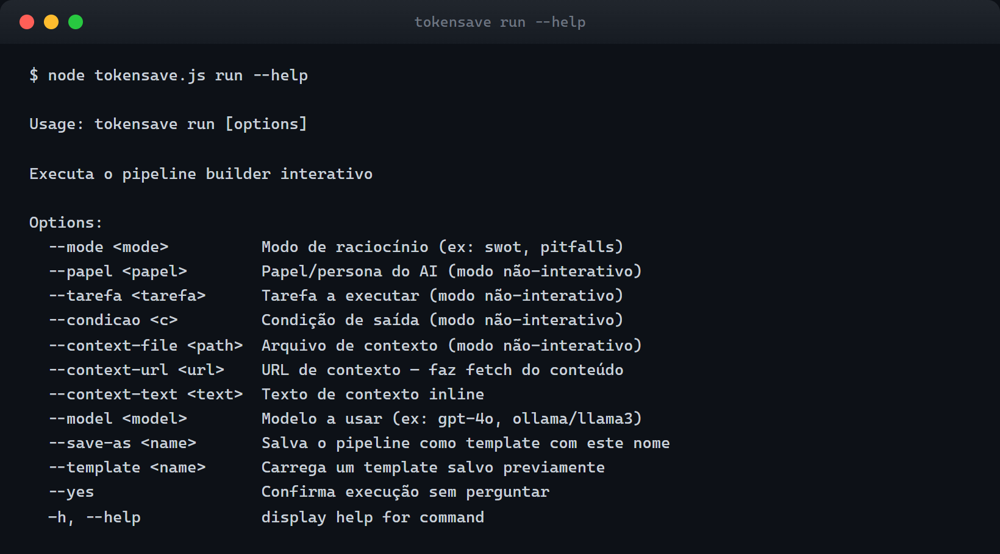

### `tokensave templates` — pipelines salvos
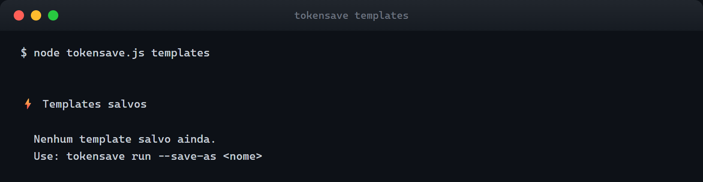

### Web Dashboard — localhost:7878
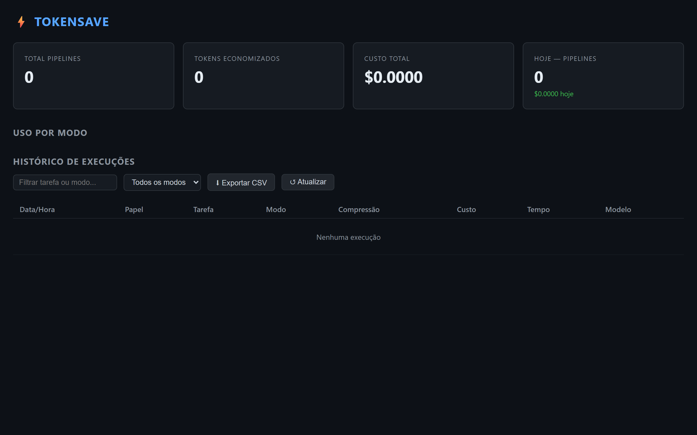

### Setup — injeta Caveman + MCP em todos os seus AI tools
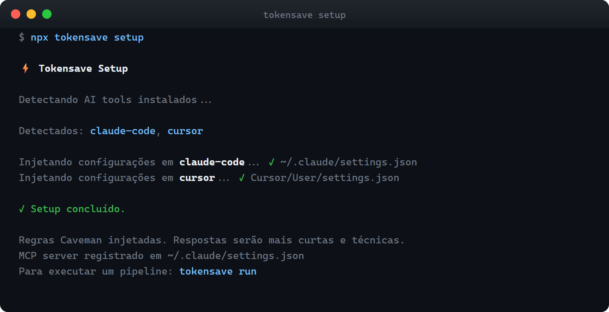

### Pipeline builder interativo
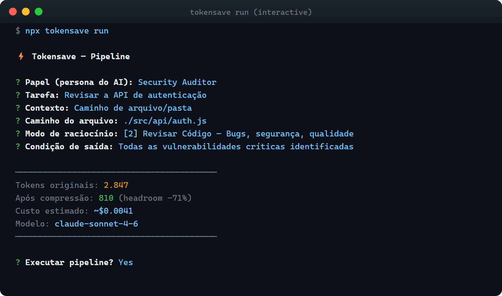

### Streaming com compressão em tempo real
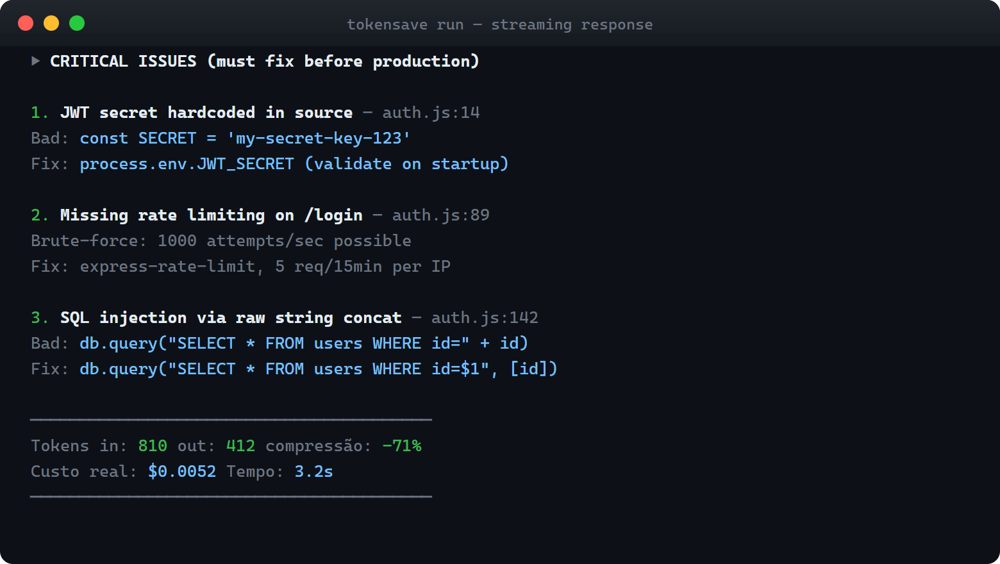

### Modo não-interativo — scripts e CI
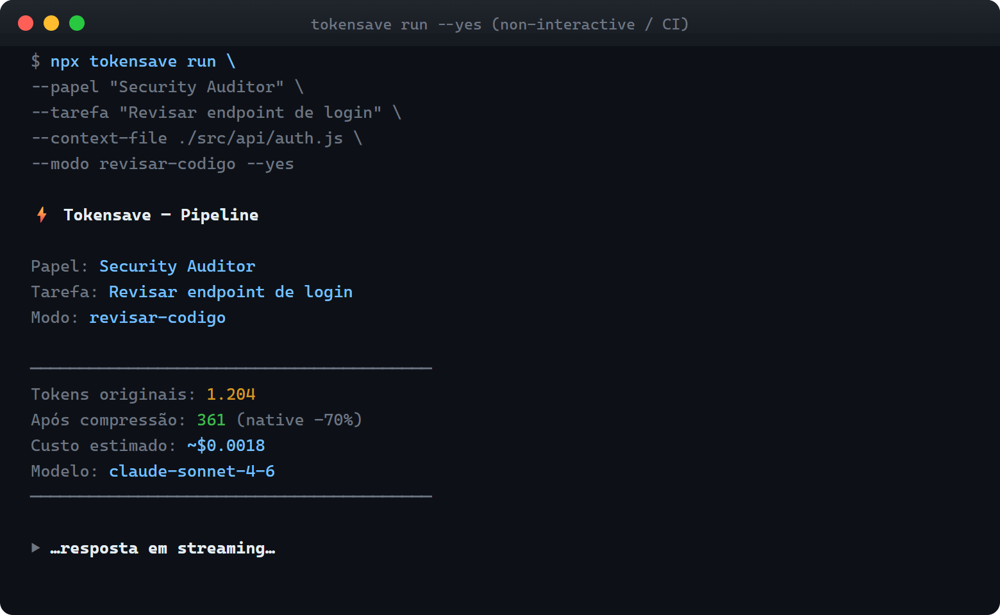

### Skills — encadeamento de modos por domínio
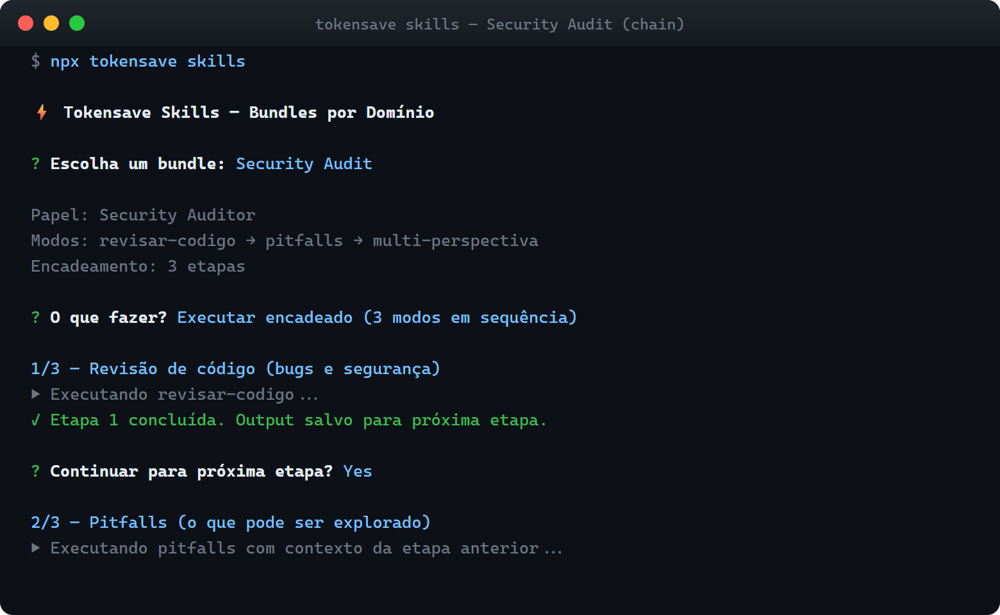

### Ollama — modelo local, zero custo por token
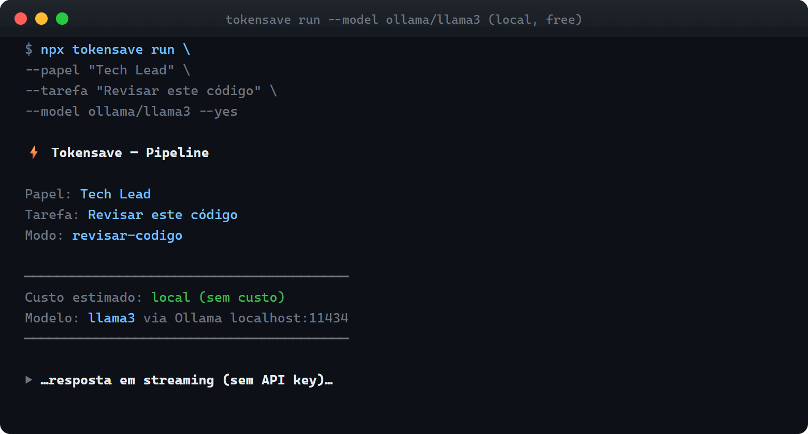

---

## 🇧🇷 Português

### Índice

- [O problema](#o-problema)
- [O que é](#o-que-é)
- [Instalação](#instalação)
- [Início rápido](#início-rápido)
- [Como funciona](#como-funciona)
- [Comandos](#comandos)
- [Modos de raciocínio](#modos-de-raciocínio)
- [Skills — bundles por domínio](#skills--bundles-por-domínio)
- [Modo não-interativo](#modo-não-interativo)
- [Templates](#templates)
- [Ollama — modelos locais](#ollama--modelos-locais)
- [MCP Server](#mcp-server)
- [Web Dashboard](#web-dashboard)
- [Modelos suportados](#modelos-suportados)
- [Variáveis de ambiente](#variáveis-de-ambiente)
- [Estrutura do projeto](#estrutura-do-projeto)
- [Arquitetura detalhada](#arquitetura-detalhada)
- [Testes](#testes)
- [Troubleshooting](#troubleshooting)
- [Créditos](#créditos)

---

### O problema

Você usa Claude Code, Cursor, Copilot ou Windsurf todo dia — e provavelmente desperdiça a maior parte dos tokens que paga.

**No input:** contexto inflado com comentários, linhas em branco, código duplicado e texto que não adiciona nenhum sinal para o modelo. Tudo vai para a API. Você paga por cada caractere.

**No output:** o modelo responde com frases de cortesia ("Claro! Fico feliz em ajudar..."), hedging ("pode ser que...", "talvez valha considerar..."), repetição do que já foi dito e parágrafos que poderiam ser uma linha. Você paga pelo ruído, não pela informação.

**Na estrutura:** prompts ad-hoc sem papel definido, sem modo de raciocínio adequado para a tarefa e sem critério de conclusão geram respostas genéricas. Um prompt vago para revisar código produz uma análise superficial. O mesmo contexto enviado com o papel certo, no modo certo, produz uma análise cirúrgica — com menos tokens.

**O resultado:** custo alto, respostas mediocres, zero visibilidade do que está sendo gasto.

---

### O que é

tokensave resolve os três problemas ao mesmo tempo. É uma CLI que estrutura como você interage com AI:

```
PAPEL → TAREFA → CONTEXTO → MODO → CONDIÇÃO
```

O sistema comprime o contexto automaticamente, injeta regras de compressão no output, chama a API com streaming e salva cada execução no SQLite com tokens e custo real.

**Economia típica: 60–75% nos tokens de entrada + 40–60% nos tokens de saída.**

| Camada | Técnica | Economia |
|--------|---------|----------|
| Input | Headroom (Python semântico) ou fallback JS nativo | 60–75% |
| Output | Regras Caveman no system prompt | 40–60% |
| Estrutura | Pipeline PAPEL→TAREFA→MODO→CONDIÇÃO | menos tokens, melhor resposta |

---

### Instalação

Sem instalação necessária. Requer apenas Node.js 18+.

```bash
npx tokensave
```

Para uso frequente, instale globalmente:

```bash
npm install -g tokensave
```

---

### Início rápido

```bash
# 1. Configure sua API key
npx tokensave config

# 2. Injeta regras Caveman no Claude Code / Cursor / Copilot / Windsurf
npx tokensave setup

# 3. Execute um pipeline estruturado
npx tokensave run

# 4. Veja quanto economizou
npx tokensave stats

# 5. Dashboard visual
npx tokensave dash --web
```

Isso é tudo. Cada `run` comprime o input, injeta as regras de output, chama a API com streaming e salva as métricas.

---

### Como funciona

#### Fluxo completo

```
npx tokensave run
       │
       ▼
  [CLI — Commander.js]
  Registra subcomandos, lazy-load via await import()
       │
       ▼
  [Pipeline Builder — Inquirer.js]
  Coleta: papel, tarefa, contexto, modo, condição
       │
       ▼
  [Compressor de Input]
  ┌─ headroom-ai (Python, 15s timeout)
  │    └─ spawnSync('headroom', ['compress', '--stdin'])
  └─ fallback nativo (JS puro)
       ├─ remove comentários (regex seguro em strings)
       ├─ colapsa linhas em branco múltiplas
       └─ truncamento inteligente se > maxTokens
       │
       ▼
  [Caveman — system prompt]
  Injeta bloco de regras no final do systemPrompt do modo
  Níveis: lite | full | ultra
       │
       ▼
  [Executor — streaming]
  ├─ detecta provedor pelo prefixo do modelo
  ├─ exibe resumo: tokens originais, comprimidos, custo estimado
  ├─ streama → Anthropic | OpenAI | Google | Ollama
  │    └─ escreve chunks em process.stdout conforme chegam
  └─ salva métricas no SQLite (~/.tokensave/metrics.db)
       │
       ▼
  [Dashboard]
  ├─ TUI: chalk + raw stdin (r/h/w/q)
  └─ Web: Hono + vanilla HTML + fetch polling 30s
```

#### As duas camadas de compressão

**Camada 1 — Input (headroom + fallback nativo)**

O `headroom-ai` é um compressor semântico em Python que remove redundâncias mantendo o significado técnico. Se não estiver instalado, o fallback nativo em JavaScript:

1. Remove comentários de linha (`//` em JS/TS, `#` em Python) sem quebrar strings
2. Colapsa múltiplas linhas em branco em uma
3. Remove trailing whitespace
4. Truncamento inteligente: mantém primeira + última metade, inserindo `[truncated by tokensave]` no meio

Estimativa de tokens usa `chars / 4` — média empírica do tokenizer GPT-4 para código técnico.

**Camada 2 — Output (Caveman)**

Não atua no contexto enviado — atua no system prompt. Injeta um bloco de regras de escrita no final de cada modo:

| Nível | Comportamento |
|-------|--------------|
| `lite` | Remove filler words e pleasantries. Mantém frases completas |
| `full` | Fragmentos OK. Remove artigos, hedging, usa sinônimos curtos |
| `ultra` | Abreviações pesadas, setas para causalidade, mínimo de palavras |

---

### Comandos

| Comando | Descrição |
|---------|-----------|
| `npx tokensave run` | Pipeline builder interativo completo |
| `npx tokensave run --mode swot` | Pula menu, vai direto para o modo |
| `npx tokensave run --mode revisar-codigo --papel "..." --tarefa "..." --yes` | Modo não-interativo |
| `npx tokensave run --context-file ./src/auth.js` | Lê arquivo como contexto |
| `npx tokensave run --context-url https://...` | Fetch de URL como contexto |
| `npx tokensave run --context-text "código aqui"` | Contexto inline |
| `npx tokensave run --model ollama/llama3` | Modelo local via Ollama |
| `npx tokensave run --save-as minha-revisao` | Salva pipeline como template |
| `npx tokensave run --template minha-revisao` | Carrega template salvo |
| `npx tokensave templates` | Lista todos os templates |
| `npx tokensave templates --delete minha-revisao` | Remove template |
| `npx tokensave setup` | Detecta AI tools, injeta Caveman + MCP server |
| `npx tokensave skills` | Menu de bundles por domínio |
| `npx tokensave dash` | Dashboard terminal (TUI) |
| `npx tokensave dash --web` | Dashboard web em localhost:7878 |
| `npx tokensave stats` | Resumo de tokens e custo no terminal |
| `npx tokensave config` | Configura API keys e modelo padrão |
| `npx tokensave mcp` | Inicia o MCP server de compressão (stdio) |

---

### Modos de raciocínio

Cada modo é um system prompt otimizado para um tipo específico de tarefa. O modo define o nível Caveman e os papéis sugeridos.

| # | ID | Nome | O que faz | Caveman |
|---|-----|------|-----------|---------|
| 1 | `criar-sistema` | Criar Sistema | Arquitetura do zero: stack, estrutura, decisões técnicas | full |
| 2 | `revisar-codigo` | Revisar Código | Bugs, segurança, qualidade, code smell | full |
| 3 | `documentacao` | Documentação | README, ADR, changelog, JSDoc | lite |
| 4 | `consultor` | Consultor | ROI, risco, decisão estratégica como C-level | full |
| 5 | `swot` | SWOT | Forças, fraquezas, oportunidades, ameaças | full |
| 6 | `compare` | Compare | A vs B com critérios explícitos e matriz de decisão | full |
| 7 | `multi-perspectiva` | Multi-perspectiva | Mesmo problema visto por Dev + PM + User + Ops | full |
| 8 | `parallel-lens` | Parallel Lens | 3 abordagens independentes simultâneas + matriz | ultra |
| 9 | `pitfalls` | Pitfalls | O que pode dar errado, armadilhas, edge cases | full |
| 10 | `metrics-mode` | Metrics Mode | Define e instrumenta KPIs mensuráveis | full |
| 11 | `context-stack` | Context Stack | Contexto progressivo em camadas sem explodir tokens | full |

```bash
# Usar um modo direto
npx tokensave run --mode pitfalls

# Ver todos os modos no menu interativo
npx tokensave run
```

---

### Skills — bundles por domínio

Skills são configurações pré-definidas de papel + modos + condição de saída para domínios específicos. Um clique e você está no fluxo certo.

| Bundle | Papel padrão | Modos encadeados |
|--------|-------------|-----------------|
| **Security Audit** | Security Auditor | Revisar Código → Pitfalls → Multi-perspectiva |
| **Data Science** | Data Scientist | Metrics Mode → Criar Sistema → Compare |
| **Database** | DBA | Criar Sistema → Revisar Código → Pitfalls |
| **Software Architect** | Arquiteto Sênior | Criar Sistema → Compare → Multi-perspectiva |
| **UX/UI** | UX Researcher | Multi-perspectiva → Consultor → Pitfalls |
| **DevOps** | SRE | Criar Sistema → Metrics Mode → Pitfalls |
| **Code Review** | Tech Lead | Revisar Código → Pitfalls → Consultor |
| **Documentation** | Technical Writer | Documentação → Context Stack |

```bash
npx tokensave skills
```

---

### Modo não-interativo

Ideal para scripts, CI/CD e automações. Passe todos os campos como flags e combine com `--yes` para zero prompts.

```bash
# Review de segurança em arquivo
npx tokensave run \
  --papel "Security Auditor" \
  --tarefa "Revisar este endpoint para vulnerabilidades OWASP Top 10" \
  --context-file ./src/api/auth.js \
  --mode revisar-codigo \
  --condicao "Todos os issues críticos identificados" \
  --yes

# Análise de PR via URL
npx tokensave run \
  --papel "Tech Lead" \
  --tarefa "Resumir as mudanças e riscos desta PR" \
  --context-url https://github.com/org/repo/pull/42 \
  --mode consultor \
  --yes

# Modelo local sem custo por token
npx tokensave run \
  --papel "Senior Engineer" \
  --tarefa "Revisar a lógica de negócio" \
  --context-file ./src/billing.js \
  --model ollama/llama3 \
  --mode revisar-codigo \
  --yes
```

**Flags disponíveis para `run`:**

| Flag | Descrição |
|------|-----------|
| `--papel <papel>` | Persona/papel do AI |
| `--tarefa <tarefa>` | Objetivo da sessão |
| `--mode <modo>` | ID do modo de raciocínio |
| `--condicao <c>` | Critério de conclusão |
| `--context-file <path>` | Lê arquivo como contexto |
| `--context-url <url>` | Faz fetch de URL como contexto |
| `--context-text <text>` | Contexto inline na flag |
| `--model <model>` | Modelo (ex: `gpt-4o`, `ollama/llama3`) |
| `--save-as <nome>` | Salva esse pipeline como template |
| `--template <nome>` | Carrega template salvo |
| `--yes` | Confirma execução sem prompts |

---

### Templates

Salve configurações completas de pipeline para reusar sem redigitar nada.

```bash
# Salvar um pipeline como template
npx tokensave run --save-as security-weekly \
  --papel "Security Auditor" \
  --mode revisar-codigo \
  --condicao "Todos os issues críticos mapeados"

# Carregar e executar (só preenche tarefa e contexto)
npx tokensave run --template security-weekly \
  --context-file ./src/api/payments.js \
  --yes

# Listar todos os templates
npx tokensave templates

# Remover
npx tokensave templates --delete security-weekly
```

Templates são salvos em `~/.tokensave/templates/` como JSON. Portáteis e editáveis.

---

### Ollama — modelos locais

Sem API key, sem custo por token. Qualquer modelo disponível no seu Ollama local.

```bash
# Listar modelos disponíveis no Ollama
ollama list

# Usar qualquer modelo
npx tokensave run --model ollama/llama3
npx tokensave run --model ollama/codellama
npx tokensave run --model ollama/mistral
npx tokensave run --model ollama/deepseek-coder
```

O Ollama deve estar rodando em `http://localhost:11434`. Para customizar:

```bash
npx tokensave config
# → definir ollama_base_url
```

---

### MCP Server

O tokensave expõe um servidor MCP (Model Context Protocol) que o Claude Code usa para comprimir contexto automaticamente antes de cada chamada de API.

```bash
# Registrado automaticamente pelo setup
npx tokensave setup

# Iniciar manualmente (protocolo stdio JSON-RPC 2.0)
npx tokensave mcp
```

**Ferramenta exposta:** `compress_context`

```json
{
  "tool": "compress_context",
  "input": {
    "text": "seu contexto aqui",
    "max_tokens": 4000
  },
  "output": {
    "compressed": "contexto comprimido",
    "original_tokens": 8000,
    "compressed_tokens": 2100,
    "method": "headroom"
  }
}
```

---

### Web Dashboard

Visibilidade completa de uso, custo e histórico de execuções.

```bash
npx tokensave dash --web
# → http://localhost:7878
```

**Endpoints REST disponíveis:**

| Endpoint | Descrição |
|----------|-----------|
| `GET /api/summary` | Total de pipelines, tokens economizados, custo |
| `GET /api/runs` | Histórico de execuções (até 500) |
| `GET /api/runs/export.csv` | Export CSV para Excel/Sheets |

O dashboard atualiza automaticamente a cada 30 segundos. HTML vanilla — sem bundler, sem framework, sem dependências no browser.

---

### Modelos suportados

| Provedor | Modelos | Variável de ambiente |
|----------|---------|---------------------|
| **Anthropic** | `claude-sonnet-4-6`, `claude-haiku-4-5` | `ANTHROPIC_API_KEY` |
| **OpenAI** | `gpt-4o`, `gpt-4o-mini` | `OPENAI_API_KEY` |
| **Google** | `gemini-1.5-pro`, `gemini-1.5-flash` | `GOOGLE_API_KEY` |
| **Ollama** | `ollama/llama3`, `ollama/codellama`, qualquer | — (local) |

---

### Variáveis de ambiente

tokensave lê API keys de duas fontes (em ordem de prioridade):

1. Arquivo `~/.tokensave/config.json` — configurado via `npx tokensave config`
2. Variáveis de ambiente do shell

| Variável | Provedor | Obrigatória |
|----------|----------|-------------|
| `ANTHROPIC_API_KEY` | Anthropic (Claude) | Para modelos `claude-*` |
| `OPENAI_API_KEY` | OpenAI (GPT) | Para modelos `gpt-*`, `o1-*` |
| `GOOGLE_API_KEY` | Google (Gemini) | Para modelos `gemini-*` |

**Usando variáveis de ambiente diretamente:**

```bash
ANTHROPIC_API_KEY=sk-ant-... npx tokensave run --mode swot --papel "..." --tarefa "..."
```

**Formato do arquivo de configuração** (`~/.tokensave/config.json`):

```json
{
  "anthropic_api_key": "sk-ant-...",
  "openai_api_key": "sk-...",
  "google_api_key": "AIza...",
  "default_model": "claude-sonnet-4-6",
  "ollama_base_url": "http://localhost:11434/v1"
}
```

---

### Estrutura do projeto

```
tokensave/
├── bin/
│   └── tokensave.js              ← entry point (npx / shebang)
├── src/
│   ├── cli/
│   │   ├── index.js              ← Commander: registra todos os subcomandos
│   │   └── commands/
│   │       ├── run.js            ← pipeline builder + executor (interativo e não-interativo)
│   │       ├── setup.js          ← detecta AI tools e injeta Caveman + MCP
│   │       ├── dash.js           ← TUI ou web dashboard
│   │       ├── skills.js         ← menu de bundles por domínio
│   │       ├── stats.js          ← resumo rápido no terminal
│   │       ├── config.js         ← API keys e modelo padrão
│   │       ├── templates.js      ← listar e remover templates
│   │       └── mcp.js            ← MCP server stdio JSON-RPC
│   ├── pipeline/
│   │   ├── builder.js            ← fluxo interativo com Inquirer.js
│   │   ├── executor.js           ← comprime, chama API, streama, salva métricas
│   │   └── modes/
│   │       ├── index.js          ← getModeById, getModeChoices, MODES[]
│   │       ├── criar-sistema.js
│   │       ├── revisar-codigo.js
│   │       ├── documentacao.js
│   │       ├── consultor.js
│   │       ├── swot.js
│   │       ├── compare.js
│   │       ├── multi-perspectiva.js
│   │       ├── parallel-lens.js
│   │       ├── pitfalls.js
│   │       ├── metrics-mode.js
│   │       └── context-stack.js
│   ├── compressor/
│   │   ├── headroom.js           ← subprocess Python headroom-ai (15s timeout)
│   │   ├── native.js             ← compressão JS pura sem Python
│   │   └── caveman.js            ← regras de output nos system prompts
│   ├── detector/
│   │   └── index.js              ← detecta Claude Code, Cursor, Copilot, Windsurf
│   ├── injector/
│   │   ├── claude-code.js        ← customInstructions em ~/.claude/settings.json
│   │   ├── cursor.js             ← cursor.rules em Cursor/User/settings.json
│   │   ├── copilot.js            ← .github/copilot-instructions.md
│   │   └── windsurf.js           ← ~/.codeium/windsurf/.windsurfrc
│   ├── store/
│   │   ├── db.js                 ← better-sqlite3, histórico em ~/.tokensave/metrics.db
│   │   └── templates.js          ← save/load JSON em ~/.tokensave/templates/
│   └── dashboard/
│       ├── tui.js                ← terminal UI com chalk + raw stdin
│       └── web/
│           ├── server.js         ← Hono HTTP server + REST API
│           └── index.html        ← dashboard web (HTML + JS vanilla)
├── skills/
│   └── index.js                  ← 8 bundles: Security Audit, DevOps, etc.
├── tests/                        ← 35 testes (vitest)
│   ├── builder.test.js
│   ├── caveman.test.js
│   ├── detector.test.js
│   ├── headroom.test.js
│   ├── modes.test.js
│   ├── native-compressor.test.js
│   └── store.test.js
└── docs/screenshots/             ← capturas reais do CLI
```

---

### Arquitetura detalhada

#### 1. CLI — Commander.js

Entry point em `bin/tokensave.js`, carrega `src/cli/index.js`. Cada subcomando é um módulo carregado de forma lazy via `await import()` — o processo inicia instantaneamente sem carregar SDKs de AI desnecessariamente.

#### 2. Pipeline Builder — `src/pipeline/builder.js`

Quando `tokensave run` é chamado sem flags suficientes, abre formulário interativo via Inquirer.js. Campos coletados:

- **PAPEL** — persona que o AI assume. Define tom e perspectiva.
- **TAREFA** — objetivo em linguagem natural.
- **CONTEXTO** — código, arquivo, URL ou texto. Lê arquivo do disco com `fs.readFileSync`.
- **MODO** — um dos 11 modos. Cada modo é um objeto `{ id, systemPrompt, cavemanLevel, papeis }`.
- **CONDIÇÃO** — critério de conclusão ("Todos os issues críticos identificados").

#### 3. Compressor — `src/compressor/`

**Input — headroom.js:**
Tenta `spawnSync('headroom', ['compress', '--stdin'])`. Se retornar status 0, usa o texto comprimido. Timeout de 15s. Fallback automático para o compressor nativo.

**Fallback nativo — native.js:**
1. Remove comentários de linha com regex que respeita strings
2. Colapsa múltiplas linhas em branco
3. Remove trailing whitespace
4. Truncamento inteligente se `> maxTokens`: mantém início + fim com marcador no meio

**Output — caveman.js:**
Injeta bloco de regras no final do `systemPrompt` de cada modo. Três níveis crescentes de compressão (`lite` → `full` → `ultra`).

#### 4. Executor — `src/pipeline/executor.js`

1. Detecta provedor pelo prefixo: `claude-*` → Anthropic, `gpt-*/o1-*` → OpenAI, `gemini-*` → Google, `ollama/*` → OpenAI-compat em localhost
2. Carrega API key do config ou variáveis de ambiente
3. Monta `userMessage`: PAPEL + TAREFA + CONTEXTO comprimido + CONDIÇÃO
4. Exibe resumo pré-execução com tokens, custo estimado e modelo
5. Streaming por provedor:
   - **Anthropic**: `client.messages.stream()` → eventos `content_block_delta`
   - **OpenAI**: `client.chat.completions.create({ stream: true })` → `choices[0].delta.content`
   - **Google**: `genModel.generateContentStream()` → `chunk.text()`
   - **Ollama**: OpenAI-compat em `http://localhost:11434/v1`
6. Retry com backoff exponencial para erros 429 e 5xx
7. Salva métricas no SQLite via `createStore()`

#### 5. Store — `src/store/db.js`

better-sqlite3 em `~/.tokensave/metrics.db`. Schema criado automaticamente com `CREATE TABLE IF NOT EXISTS`. Prepared statements para performance.

**Schema:**

```sql
CREATE TABLE IF NOT EXISTS pipeline_runs (
  id            INTEGER PRIMARY KEY AUTOINCREMENT,
  created_at    TEXT DEFAULT (datetime('now')),
  papel         TEXT,
  tarefa        TEXT,
  modo          TEXT,
  model         TEXT,
  project_root  TEXT,
  tokens_original   INTEGER,
  tokens_compressed INTEGER,
  tokens_output     INTEGER,
  cost_usd          REAL,
  duration_ms       INTEGER,
  success           INTEGER DEFAULT 1
)
```

**Métodos:** `saveRun`, `getRecentRuns`, `getSummary`, `getTodaySummary`, `getModeStats`

#### 6. Setup e Injeção — `src/detector/` + `src/injector/`

O detector usa `fs.existsSync` em caminhos conhecidos para identificar cada tool. Cada injector:
1. Lê o arquivo de configuração existente
2. Verifica se o marcador `TOKENSAVE` já existe (idempotente — sem duplicação)
3. Escreve as regras Caveman na posição correta

| Tool | Arquivo modificado |
|------|--------------------|
| Claude Code | `~/.claude/settings.json` → `customInstructions` + `mcpServers.tokensave-headroom` |
| Cursor | `~/AppData/Roaming/Cursor/User/settings.json` → `cursor.rules` |
| GitHub Copilot | `.github/copilot-instructions.md` |
| Windsurf | `~/.codeium/windsurf/.windsurfrc` |

---

### Testes

```bash
# Rodar todos os testes
npm test

# Watch mode
npm run test:watch
```

```
tests/
├── builder.test.js          — 2 testes: lógica do pipeline builder
├── caveman.test.js          — 5 testes: níveis lite/full/ultra, validação
├── detector.test.js         — 10 testes: detecção de Claude Code, Cursor, Copilot, Windsurf
├── headroom.test.js         — 3 testes: integração com subprocess Python
├── modes.test.js            — 7 testes: 11 modos registrados, campos obrigatórios
├── native-compressor.test.js — 5 testes: remoção de comentários, colapso de linhas
└── store.test.js            — 3 testes: CRUD SQLite, queries de métricas

Total: 35 testes — 100% passando
```

---

### Troubleshooting

**`✗ Sem API key para anthropic`**

```bash
# Opção 1: configurar via CLI
npx tokensave config

# Opção 2: variável de ambiente
export ANTHROPIC_API_KEY=sk-ant-...
npx tokensave run ...
```

**`✗ API error: Connection error` (Ollama)**

```bash
# Verificar se Ollama está rodando
ollama list

# Iniciar Ollama
ollama serve
```

**`✗ Não foi possível ler: <arquivo>`**

O `--context-file` usa o caminho relativo ao diretório atual. Use caminho absoluto ou verifique `pwd`.

**Headroom não encontrado (usa fallback nativo automaticamente)**

O headroom é opcional. Para instalar e habilitar a compressão máxima:

```bash
pip install headroom-ai
```

Verifique se `headroom` está no PATH: `headroom --version`

**Dashboard não abre no browser**

```bash
# Verificar se a porta 7878 está em uso
npx tokensave dash --web
# → Acessar manualmente: http://localhost:7878
```

**Setup não detecta meu AI tool**

```bash
# Verificar quais tools foram detectados
npx tokensave setup
# → Mostra lista de tools detectados e caminhos modificados
```

---

### Requisitos

- **Node.js 18+** (obrigatório)
- **API key** de pelo menos um provedor — Anthropic, OpenAI, Google, ou Ollama local
- **Python 3.10+** com `headroom-ai` — opcional, para compressão máxima de input

---

### Créditos

| Pacote | Uso no tokensave |
|--------|-----------------|
| [Commander.js](https://github.com/tj/commander.js) | Parser de subcomandos e flags |
| [Inquirer.js](https://github.com/SBoudrias/Inquirer.js) | Formulário interativo do pipeline builder |
| [Chalk](https://github.com/chalk/chalk) | Cores e formatação no terminal |
| [Hono](https://github.com/honojs/hono) | Web framework do dashboard |
| [@hono/node-server](https://github.com/honojs/node-server) | Adapter Node.js para Hono |
| [better-sqlite3](https://github.com/WiseLibs/better-sqlite3) | Banco SQLite local para métricas |
| [@anthropic-ai/sdk](https://github.com/anthropics/anthropic-sdk-node) | Client Anthropic com streaming |
| [openai](https://github.com/openai/openai-node) | Client OpenAI com streaming |
| [@google/generative-ai](https://github.com/google-gemini/generative-ai-js) | Client Google Gemini |
| [open](https://github.com/sindresorhus/open) | Abre dashboard no browser |
| [headroom-ai](https://github.com/outlines-dev/headroom) | Compressor semântico de contexto |
| [vitest](https://github.com/vitest-dev/vitest) | Test runner |

---

### Licença

MIT © [Diego Lial](https://github.com/DiegoLial)

---

---

## 🇺🇸 English

### Table of Contents

- [The problem](#the-problem)
- [What it is](#what-it-is)
- [Installation](#installation)
- [Quickstart](#quickstart)
- [How it works](#how-it-works)
- [Commands](#commands)
- [Reasoning modes](#reasoning-modes)
- [Skills — domain bundles](#skills--domain-bundles)
- [Non-interactive mode](#non-interactive-mode)
- [Templates](#templates-1)
- [Ollama — local models](#ollama--local-models)
- [MCP Server](#mcp-server-1)
- [Web Dashboard](#web-dashboard-1)
- [Supported models](#supported-models)
- [Environment variables](#environment-variables)
- [Project structure](#project-structure)
- [Architecture](#architecture)
- [Tests](#tests)
- [Troubleshooting](#troubleshooting-1)
- [Credits](#credits)

---

### The problem

You use Claude Code, Cursor, Copilot, or Windsurf every day — and you're probably wasting most of the tokens you're paying for.

**On the input side:** bloated context full of comments, blank lines, repeated code, and text that adds zero signal for the model. All of it hits the API, and you pay for every character.

**On the output side:** the model responds with pleasantries ("Sure! I'd be happy to help..."), hedging ("it might be worth considering...", "you could potentially..."), repetition of what was already said, and paragraphs that could be a single line. You pay for the noise, not the information.

**On the structure side:** ad-hoc prompts with no defined role, no reasoning mode matched to the task, and no exit condition produce generic responses. A vague code review prompt produces a shallow answer. The same context with the right role, in the right mode, produces a surgical analysis — with fewer tokens.

**The result:** high cost, mediocre responses, zero visibility into what's being spent.

---

### What it is

tokensave solves all three problems at once. It's a CLI that structures how you interact with AI:

```
ROLE → TASK → CONTEXT → MODE → CONDITION
```

The system auto-compresses the context, injects output compression rules, calls the API with streaming, and saves every run to SQLite with real token and cost metrics.

**Typical savings: 60–75% on input tokens + 40–60% on output tokens.**

| Layer | Technique | Savings |
|-------|-----------|---------|
| Input | Headroom (semantic Python) or native JS fallback | 60–75% |
| Output | Caveman rules in system prompt | 40–60% |
| Structure | ROLE→TASK→MODE→CONDITION pipeline | fewer tokens, better responses |

---

### Installation

No installation needed. Requires Node.js 18+ only.

```bash
npx tokensave
```

For frequent use, install globally:

```bash
npm install -g tokensave
```

---

### Quickstart

```bash
# 1. Set your API key
npx tokensave config

# 2. Inject Caveman rules into Claude Code / Cursor / Copilot / Windsurf
npx tokensave setup

# 3. Run a structured pipeline
npx tokensave run

# 4. Check your savings
npx tokensave stats

# 5. Visual dashboard
npx tokensave dash --web
```

That's it. Every `run` compresses the input, injects output rules, calls the API with streaming, and saves the metrics.

---

### How it works

#### Full data flow

```
npx tokensave run
       │
       ▼
  [CLI — Commander.js]
  Registers subcommands, lazy-load via await import()
       │
       ▼
  [Pipeline Builder — Inquirer.js]
  Collects: role, task, context, mode, condition
       │
       ▼
  [Input Compressor]
  ┌─ headroom-ai (Python subprocess, 15s timeout)
  │    └─ spawnSync('headroom', ['compress', '--stdin'])
  └─ native JS fallback
       ├─ strip comments (regex, string-safe)
       ├─ collapse multiple blank lines
       └─ smart truncation if > maxTokens
       │
       ▼
  [Caveman — system prompt]
  Appends compression rules to mode's systemPrompt
  Levels: lite | full | ultra
       │
       ▼
  [Executor — streaming]
  ├─ detect provider by model prefix
  ├─ show pre-run summary: original tokens, compressed, estimated cost
  ├─ stream → Anthropic | OpenAI | Google | Ollama
  │    └─ writes chunks to process.stdout as they arrive
  └─ save metrics to SQLite (~/.tokensave/metrics.db)
       │
       ▼
  [Dashboard]
  ├─ TUI: chalk + raw stdin (r/h/w/q)
  └─ Web: Hono + vanilla HTML + fetch polling 30s
```

#### Two-layer compression

**Layer 1 — Input (headroom + native fallback)**

`headroom-ai` is a semantic Python compressor that removes redundancy while preserving technical meaning. If not installed, the native JS fallback:

1. Strips line comments (`//` in JS/TS, `#` in Python) without breaking strings
2. Collapses multiple blank lines into one
3. Removes trailing whitespace
4. Smart truncation: keeps first + last half, inserts `[truncated by tokensave]` marker in the middle

Token estimation uses `chars / 4` — empirical average of the GPT-4 tokenizer for technical text and code.

**Layer 2 — Output (Caveman)**

Does not compress the sent context — operates on the system prompt. Appends a writing-rules block to the end of every mode's system prompt:

| Level | Behavior |
|-------|---------|
| `lite` | Remove filler words and pleasantries. Keep full sentences |
| `full` | Fragments OK. Remove articles, hedging, use short synonyms |
| `ultra` | Heavy abbreviations, arrows for causality, minimum possible words |

---

### Commands

| Command | Description |
|---------|-------------|
| `npx tokensave run` | Full interactive pipeline builder |
| `npx tokensave run --mode swot` | Skip menu, jump to a specific mode |
| `npx tokensave run --mode revisar-codigo --papel "..." --tarefa "..." --yes` | Non-interactive mode |
| `npx tokensave run --context-file ./src/auth.js` | Read file as context |
| `npx tokensave run --context-url https://...` | Fetch URL as context |
| `npx tokensave run --context-text "code here"` | Inline context via flag |
| `npx tokensave run --model ollama/llama3` | Local model via Ollama |
| `npx tokensave run --save-as my-review` | Save pipeline as reusable template |
| `npx tokensave run --template my-review` | Load a saved template |
| `npx tokensave templates` | List all saved templates |
| `npx tokensave templates --delete my-review` | Delete a template |
| `npx tokensave setup` | Detect AI tools, inject Caveman + MCP server |
| `npx tokensave skills` | Domain skill bundle menu |
| `npx tokensave dash` | Terminal dashboard (TUI) |
| `npx tokensave dash --web` | Web dashboard at localhost:7878 |
| `npx tokensave stats` | Token savings and cost summary |
| `npx tokensave config` | Set API keys and default model |
| `npx tokensave mcp` | Start the compression MCP server (stdio) |

---

### Reasoning modes

Each mode is a system prompt engineered for a specific type of reasoning task. The mode sets the Caveman level and suggested personas.

| # | ID | Name | What it does | Caveman |
|---|-----|------|-------------|---------|
| 1 | `criar-sistema` | Criar Sistema | Architecture from scratch: stack, structure, technical decisions | full |
| 2 | `revisar-codigo` | Revisar Código | Bugs, security, quality, code smell | full |
| 3 | `documentacao` | Documentação | README, ADR, changelog, JSDoc | lite |
| 4 | `consultor` | Consultor | ROI, risk, C-level strategic decision | full |
| 5 | `swot` | SWOT | Strengths, weaknesses, opportunities, threats | full |
| 6 | `compare` | Compare | A vs B with explicit criteria and decision matrix | full |
| 7 | `multi-perspectiva` | Multi-perspectiva | Same problem through Dev + PM + User + Ops lenses | full |
| 8 | `parallel-lens` | Parallel Lens | 3 fully independent approaches + decision matrix | ultra |
| 9 | `pitfalls` | Pitfalls | What can go wrong, traps, edge cases | full |
| 10 | `metrics-mode` | Metrics Mode | Define and instrument measurable KPIs | full |
| 11 | `context-stack` | Context Stack | Progressive context layering without token explosion | full |

```bash
# Use a mode directly
npx tokensave run --mode pitfalls

# Explore all modes interactively
npx tokensave run
```

---

### Skills — domain bundles

Skills are pre-configured sets of role + modes + exit condition for specific domains. One click and you're in the right flow.

| Bundle | Default Role | Chained Modes |
|--------|-------------|--------------|
| **Security Audit** | Security Auditor | Revisar Código → Pitfalls → Multi-perspectiva |
| **Data Science** | Data Scientist | Metrics Mode → Criar Sistema → Compare |
| **Database** | DBA | Criar Sistema → Revisar Código → Pitfalls |
| **Software Architect** | Senior Architect | Criar Sistema → Compare → Multi-perspectiva |
| **UX/UI** | UX Researcher | Multi-perspectiva → Consultor → Pitfalls |
| **DevOps** | SRE | Criar Sistema → Metrics Mode → Pitfalls |
| **Code Review** | Tech Lead | Revisar Código → Pitfalls → Consultor |
| **Documentation** | Technical Writer | Documentação → Context Stack |

```bash
npx tokensave skills
```

---

### Non-interactive mode

Ideal for scripts, CI/CD, and automations. Pass all fields as flags and combine with `--yes` for zero prompts.

```bash
# Security review of a file
npx tokensave run \
  --papel "Security Auditor" \
  --tarefa "Review this endpoint for OWASP Top 10 vulnerabilities" \
  --context-file ./src/api/auth.js \
  --mode revisar-codigo \
  --condicao "All critical issues identified" \
  --yes

# PR analysis via URL
npx tokensave run \
  --papel "Tech Lead" \
  --tarefa "Summarize the changes and risks in this PR" \
  --context-url https://github.com/org/repo/pull/42 \
  --mode consultor \
  --yes

# Local model — no cost per token
npx tokensave run \
  --papel "Senior Engineer" \
  --tarefa "Review the business logic" \
  --context-file ./src/billing.js \
  --model ollama/llama3 \
  --mode revisar-codigo \
  --yes
```

**All flags for `run`:**

| Flag | Description |
|------|-------------|
| `--papel <role>` | AI persona/role |
| `--tarefa <task>` | Session objective |
| `--mode <mode>` | Reasoning mode ID |
| `--condicao <c>` | Done-when criteria |
| `--context-file <path>` | Read file as context |
| `--context-url <url>` | Fetch URL as context |
| `--context-text <text>` | Inline context via flag |
| `--model <model>` | Model (e.g. `gpt-4o`, `ollama/llama3`) |
| `--save-as <name>` | Save this pipeline as a template |
| `--template <name>` | Load a saved template |
| `--yes` | Confirm execution without prompts |

---

### Templates

Save complete pipeline configurations to reuse without retyping anything.

```bash
# Save a pipeline as a template
npx tokensave run --save-as security-weekly \
  --papel "Security Auditor" \
  --mode revisar-codigo \
  --condicao "All critical issues mapped"

# Load and run (only needs task and context)
npx tokensave run --template security-weekly \
  --context-file ./src/api/payments.js \
  --yes

# List all templates
npx tokensave templates

# Delete
npx tokensave templates --delete security-weekly
```

Templates are saved as JSON in `~/.tokensave/templates/`. Portable and editable.

---

### Ollama — local models

No API key, no per-token cost. Any model available in your local Ollama instance.

```bash
# List available models
ollama list

# Use any model
npx tokensave run --model ollama/llama3
npx tokensave run --model ollama/codellama
npx tokensave run --model ollama/mistral
npx tokensave run --model ollama/deepseek-coder
```

Requires Ollama running at `http://localhost:11434`. To customize:

```bash
npx tokensave config
# → set ollama_base_url
```

---

### MCP Server

tokensave exposes an MCP (Model Context Protocol) server that Claude Code uses to automatically compress context before each API call.

```bash
# Auto-registered in ~/.claude/settings.json by setup
npx tokensave setup

# Start manually (stdio JSON-RPC 2.0)
npx tokensave mcp
```

**Exposed tool:** `compress_context`

```json
{
  "tool": "compress_context",
  "input": {
    "text": "your context here",
    "max_tokens": 4000
  },
  "output": {
    "compressed": "compressed context",
    "original_tokens": 8000,
    "compressed_tokens": 2100,
    "method": "headroom"
  }
}
```

---

### Web Dashboard

Full visibility into usage, cost, and run history.

```bash
npx tokensave dash --web
# → http://localhost:7878
```

**Available REST endpoints:**

| Endpoint | Description |
|----------|-------------|
| `GET /api/summary` | Total pipelines, tokens saved, cost |
| `GET /api/runs` | Run history (up to 500) |
| `GET /api/runs/export.csv` | CSV export for Excel/Sheets |

The dashboard auto-refreshes every 30 seconds. Vanilla HTML — no bundler, no framework, no browser dependencies.

---

### Supported models

| Provider | Models | Environment variable |
|----------|--------|---------------------|
| **Anthropic** | `claude-sonnet-4-6`, `claude-haiku-4-5` | `ANTHROPIC_API_KEY` |
| **OpenAI** | `gpt-4o`, `gpt-4o-mini` | `OPENAI_API_KEY` |
| **Google** | `gemini-1.5-pro`, `gemini-1.5-flash` | `GOOGLE_API_KEY` |
| **Ollama** | `ollama/llama3`, `ollama/codellama`, any | — (local) |

---

### Environment variables

tokensave reads API keys from two sources (in priority order):

1. `~/.tokensave/config.json` — configured via `npx tokensave config`
2. Shell environment variables

| Variable | Provider | Required for |
|----------|----------|-------------|
| `ANTHROPIC_API_KEY` | Anthropic (Claude) | `claude-*` models |
| `OPENAI_API_KEY` | OpenAI (GPT) | `gpt-*`, `o1-*` models |
| `GOOGLE_API_KEY` | Google (Gemini) | `gemini-*` models |

**Using environment variables directly:**

```bash
ANTHROPIC_API_KEY=sk-ant-... npx tokensave run --mode swot --papel "..." --tarefa "..."
```

**Config file format** (`~/.tokensave/config.json`):

```json
{
  "anthropic_api_key": "sk-ant-...",
  "openai_api_key": "sk-...",
  "google_api_key": "AIza...",
  "default_model": "claude-sonnet-4-6",
  "ollama_base_url": "http://localhost:11434/v1"
}
```

---

### Project structure

```
tokensave/
├── bin/
│   └── tokensave.js              ← entry point (npx / shebang)
├── src/
│   ├── cli/
│   │   ├── index.js              ← Commander: registers all subcommands
│   │   └── commands/
│   │       ├── run.js            ← pipeline builder + executor (interactive & non-interactive)
│   │       ├── setup.js          ← detect AI tools, inject Caveman + MCP
│   │       ├── dash.js           ← TUI or web dashboard
│   │       ├── skills.js         ← domain bundle menu
│   │       ├── stats.js          ← quick terminal summary
│   │       ├── config.js         ← API keys and default model
│   │       ├── templates.js      ← list and delete templates
│   │       └── mcp.js            ← MCP server stdio JSON-RPC
│   ├── pipeline/
│   │   ├── builder.js            ← interactive flow with Inquirer.js
│   │   ├── executor.js           ← compress, call API, stream, save metrics
│   │   └── modes/
│   │       ├── index.js          ← getModeById, getModeChoices, MODES[]
│   │       └── [11 mode files]
│   ├── compressor/
│   │   ├── headroom.js           ← Python headroom-ai subprocess (15s timeout)
│   │   ├── native.js             ← pure JS compression, no Python needed
│   │   └── caveman.js            ← output compression rules in system prompts
│   ├── detector/
│   │   └── index.js              ← detects Claude Code, Cursor, Copilot, Windsurf
│   ├── injector/
│   │   ├── claude-code.js        ← customInstructions in ~/.claude/settings.json
│   │   ├── cursor.js             ← cursor.rules in Cursor/User/settings.json
│   │   ├── copilot.js            ← .github/copilot-instructions.md
│   │   └── windsurf.js           ← ~/.codeium/windsurf/.windsurfrc
│   ├── store/
│   │   ├── db.js                 ← better-sqlite3, history in ~/.tokensave/metrics.db
│   │   └── templates.js          ← save/load JSON in ~/.tokensave/templates/
│   └── dashboard/
│       ├── tui.js                ← terminal UI with chalk + raw stdin
│       └── web/
│           ├── server.js         ← Hono HTTP server + REST API
│           └── index.html        ← web dashboard (vanilla HTML + JS)
├── skills/
│   └── index.js                  ← 8 bundles: Security Audit, DevOps, etc.
├── tests/                        ← 35 tests (vitest)
└── docs/screenshots/             ← real CLI captures
```

---

### Architecture

#### 1. CLI — Commander.js

Entry point at `bin/tokensave.js`, loads `src/cli/index.js`. Each subcommand is a separate module loaded lazily via `await import()` — the process starts instantly without loading AI SDKs unnecessarily.

#### 2. Pipeline Builder — `src/pipeline/builder.js`

When `tokensave run` is called without sufficient flags, opens an interactive form via Inquirer.js. Collected fields:

- **ROLE** — AI persona. Sets tone and perspective of the response.
- **TASK** — session objective in natural language.
- **CONTEXT** — code, file, URL, or text. Reads file from disk with `fs.readFileSync`.
- **MODE** — one of 11 reasoning modes. Each mode is `{ id, systemPrompt, cavemanLevel, papeis }`.
- **CONDITION** — done-when criteria ("All critical vulnerabilities identified").

#### 3. Compressor — `src/compressor/`

**Input — headroom.js:**
Tries `spawnSync('headroom', ['compress', '--stdin'])`. If it returns status 0, uses the compressed text. 15s timeout. Auto-fallback to native.

**Native fallback — native.js:**
1. Strips line comments with string-safe regex
2. Collapses multiple blank lines into one
3. Removes trailing whitespace
4. Smart truncation if `> maxTokens`: keeps start + end with marker in the middle

**Output — caveman.js:**
Appends a writing-rules block to the end of every mode's `systemPrompt`. Three increasing levels of compression (`lite` → `full` → `ultra`).

#### 4. Executor — `src/pipeline/executor.js`

1. Detect provider by prefix: `claude-*` → Anthropic, `gpt-*/o1-*` → OpenAI, `gemini-*` → Google, `ollama/*` → OpenAI-compat at localhost
2. Load API key from config or environment variables
3. Assemble `userMessage`: ROLE + TASK + compressed CONTEXT + CONDITION
4. Show pre-run summary with tokens, estimated cost, and model
5. Streaming per provider:
   - **Anthropic**: `client.messages.stream()` → `content_block_delta` events
   - **OpenAI**: `client.chat.completions.create({ stream: true })` → `choices[0].delta.content`
   - **Google**: `genModel.generateContentStream()` → `chunk.text()`
   - **Ollama**: OpenAI-compat at `http://localhost:11434/v1`
6. Exponential backoff retry for 429 and 5xx errors
7. Save metrics to SQLite via `createStore()`

#### 5. Store — `src/store/db.js`

better-sqlite3 at `~/.tokensave/metrics.db`. Schema auto-created with `CREATE TABLE IF NOT EXISTS`. Prepared statements for performance.

**Schema:**

```sql
CREATE TABLE IF NOT EXISTS pipeline_runs (
  id                INTEGER PRIMARY KEY AUTOINCREMENT,
  created_at        TEXT DEFAULT (datetime('now')),
  papel             TEXT,
  tarefa            TEXT,
  modo              TEXT,
  model             TEXT,
  project_root      TEXT,
  tokens_original   INTEGER,
  tokens_compressed INTEGER,
  tokens_output     INTEGER,
  cost_usd          REAL,
  duration_ms       INTEGER,
  success           INTEGER DEFAULT 1
)
```

**Methods:** `saveRun`, `getRecentRuns`, `getSummary`, `getTodaySummary`, `getModeStats`

#### 6. Setup & Injection — `src/detector/` + `src/injector/`

The detector uses `fs.existsSync` on known paths to identify each tool. Each injector:
1. Reads the existing config file
2. Checks if the `TOKENSAVE` marker already exists (idempotent — no duplication)
3. Writes Caveman rules at the correct position

| Tool | File modified |
|------|--------------|
| Claude Code | `~/.claude/settings.json` → `customInstructions` + `mcpServers.tokensave-headroom` |
| Cursor | `~/AppData/Roaming/Cursor/User/settings.json` → `cursor.rules` |
| GitHub Copilot | `.github/copilot-instructions.md` |
| Windsurf | `~/.codeium/windsurf/.windsurfrc` |

---

### Tests

```bash
# Run all tests
npm test

# Watch mode
npm run test:watch
```

```
tests/
├── builder.test.js           — 2 tests: pipeline builder logic
├── caveman.test.js           — 5 tests: lite/full/ultra levels, validation
├── detector.test.js          — 10 tests: Claude Code, Cursor, Copilot, Windsurf detection
├── headroom.test.js          — 3 tests: Python subprocess integration
├── modes.test.js             — 7 tests: 11 modes registered, required fields
├── native-compressor.test.js — 5 tests: comment stripping, blank line collapse
└── store.test.js             — 3 tests: SQLite CRUD, metrics queries

Total: 35 tests — 100% passing
```

---

### Troubleshooting

**`✗ Sem API key para anthropic` / No API key**

```bash
# Option 1: configure via CLI
npx tokensave config

# Option 2: environment variable
export ANTHROPIC_API_KEY=sk-ant-...
npx tokensave run ...
```

**`✗ API error: Connection error` (Ollama)**

```bash
# Check if Ollama is running
ollama list

# Start Ollama
ollama serve
```

**`✗ Não foi possível ler: <file>`**

`--context-file` resolves relative to current directory. Use an absolute path or check `pwd`.

**Headroom not found (automatically falls back to native)**

headroom is optional. To install for maximum compression:

```bash
pip install headroom-ai
```

Verify it's on PATH: `headroom --version`

**Dashboard doesn't open in browser**

```bash
npx tokensave dash --web
# → Open manually: http://localhost:7878
```

**Setup doesn't detect my AI tool**

```bash
npx tokensave setup
# → Shows list of detected tools and modified paths
```

---

### Requirements

- **Node.js 18+** (required)
- **API key** for at least one provider — Anthropic, OpenAI, Google, or local Ollama
- **Python 3.10+** with `headroom-ai` — optional, for maximum input compression

---

### Credits

| Package | Use in tokensave |
|---------|-----------------|
| [Commander.js](https://github.com/tj/commander.js) | CLI subcommand parser and flags |
| [Inquirer.js](https://github.com/SBoudrias/Inquirer.js) | Interactive pipeline builder form |
| [Chalk](https://github.com/chalk/chalk) | Terminal colors and formatting |
| [Hono](https://github.com/honojs/hono) | Dashboard web framework |
| [@hono/node-server](https://github.com/honojs/node-server) | Node.js adapter for Hono |
| [better-sqlite3](https://github.com/WiseLibs/better-sqlite3) | Local SQLite for metrics history |
| [@anthropic-ai/sdk](https://github.com/anthropics/anthropic-sdk-node) | Anthropic client with streaming |
| [openai](https://github.com/openai/openai-node) | OpenAI client with streaming |
| [@google/generative-ai](https://github.com/google-gemini/generative-ai-js) | Google Gemini client |
| [open](https://github.com/sindresorhus/open) | Opens dashboard in browser |
| [headroom-ai](https://github.com/outlines-dev/headroom) | Semantic context compressor |
| [vitest](https://github.com/vitest-dev/vitest) | Test runner |

---

### License

MIT © [Diego Lial](https://github.com/DiegoLial)
