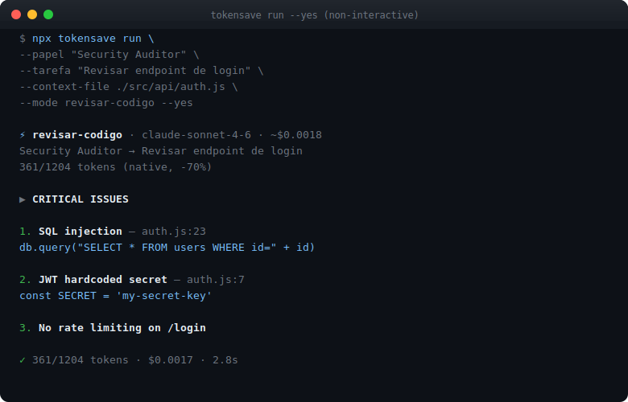
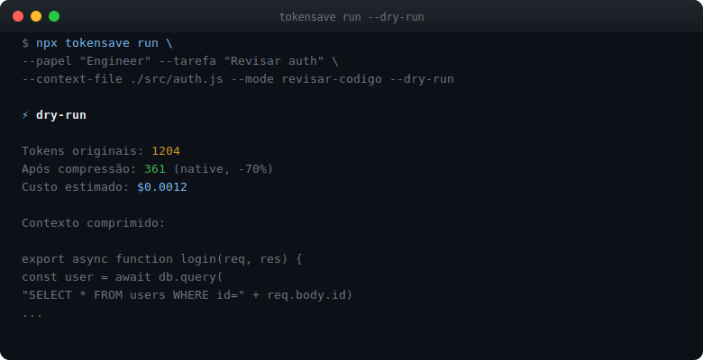
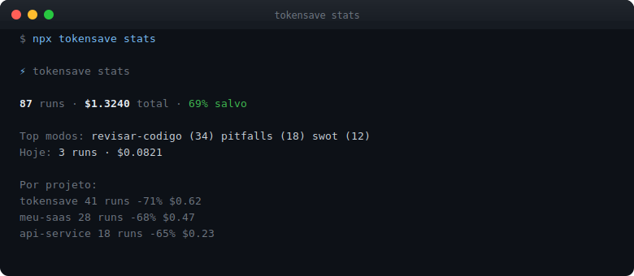
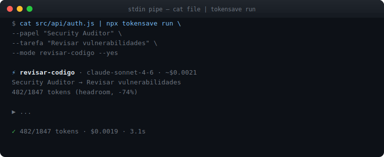
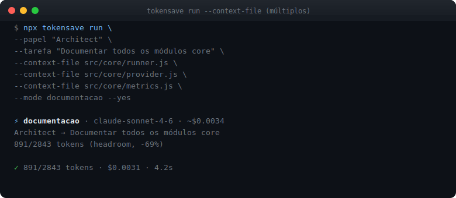
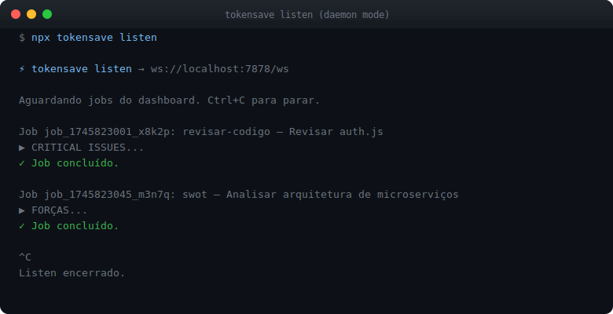
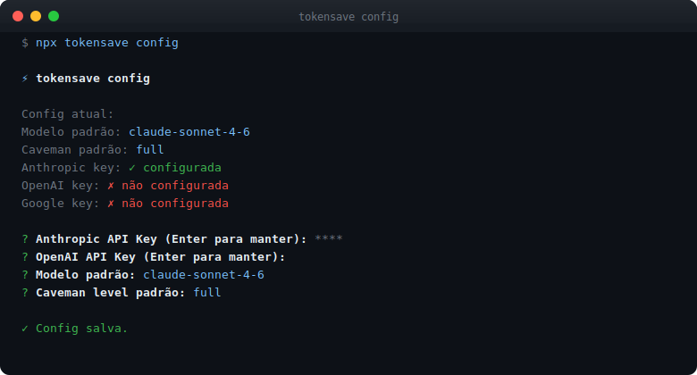

<div align="center">

# ⚡ tokensave

### Structured AI pipeline for any tool. One command. 70% less tokens.

[](https://www.npmjs.com/package/tokensave)
[](LICENSE)
[](https://nodejs.org)
[](#testing)
[](package.json)

</div>

tokensave is a CLI that wraps any AI model (Claude, GPT-4o, Gemini, Ollama) with a compression pipeline that strips noise from your context before it reaches the model — cutting token usage by 60–75% while preserving the information that matters. It ships 11 reasoning modes, a web dashboard, template management, a WebSocket daemon, and an MCP server for native Claude Code integration.

---

## Table of Contents

- [Key Features](#key-features)
- [Tech Stack](#tech-stack)
- [Prerequisites](#prerequisites)
- [Quick Start](#quick-start)
- [Installation](#installation)
- [Commands](#commands)
  - [run](#run)
  - [dash](#dash)
  - [listen](#listen)
  - [stats](#stats)
  - [templates](#templates-command)
  - [config](#config)
  - [setup](#setup)
  - [skills](#skills)
  - [mcp](#mcp)
- [Reasoning Modes](#reasoning-modes)
- [Context Sources](#context-sources)
- [Templates](#templates-1)
- [Web Dashboard](#web-dashboard)
- [MCP Server](#mcp-server)
- [Configuration](#configuration)
- [Architecture](#architecture)
- [Testing](#testing)
- [Troubleshooting](#troubleshooting)

---

## Key Features

- **70% fewer tokens** — dual compression pipeline (headroom + native caveman) applied before every API call
- **11 reasoning modes** — structured prompts for code review, SWOT, pitfalls, architecture, docs, comparison, and more
- **Non-interactive mode** — fully scriptable via flags; pipe from stdin; load multiple files or URLs
- **Web dashboard** — 4-tab SPA at `localhost:7878`: dispatch jobs, view history, manage templates, configure settings
- **WebSocket daemon** (`listen`) — keep a terminal worker running; trigger jobs from the browser without leaving it
- **Template system** — save any pipeline configuration; rerun in one command
- **Multi-provider** — Claude (Anthropic), GPT-4o (OpenAI), Gemini (Google), Ollama (local, free)
- **MCP server** — plug tokensave compression directly into Claude Code as a native tool
- **SQLite history** — every run saved automatically; export CSV from the dashboard
- **--dry-run** — preview compressed prompt and estimated cost before spending a token

---

## Screenshots

### Help — all commands


### Non-interactive pipeline run



### Dry-run preview



### Stats summary



### Stdin pipe



### Multiple context files



### Templates


### Listen daemon



### Config



---

## Tech Stack

| Layer | Technology |
|---|---|
| Runtime | Node.js 18+ |
| CLI framework | Commander.js |
| Interactive prompts | Inquirer.js |
| HTTP server | Hono + `@hono/node-server` |
| WebSocket | `ws` |
| Database | SQLite via `better-sqlite3` |
| AI providers | `@anthropic-ai/sdk`, `openai`, `@google/generative-ai` |
| Terminal styling | Chalk |
| Test framework | Vitest |

---

## Prerequisites

- **Node.js 18 or higher** — verify with `node --version`
- At least one AI provider API key:
  - Anthropic: [console.anthropic.com](https://console.anthropic.com)
  - OpenAI: [platform.openai.com](https://platform.openai.com)
  - Google AI: [aistudio.google.com](https://aistudio.google.com)
  - Ollama (free, local): [ollama.ai](https://ollama.ai) — no key needed

---

## Quick Start

```bash
# Run interactively — prompts you through every step
npx tokensave run

# Non-interactive code review in one line
npx tokensave run \
  --papel "Security Auditor" \
  --tarefa "Review this endpoint for vulnerabilities" \
  --context-file ./src/api/auth.js \
  --mode revisar-codigo \
  --yes

# Preview tokens + cost without calling the API
npx tokensave run \
  --papel "Engineer" \
  --tarefa "Review auth" \
  --context-file ./src/auth.js \
  --mode revisar-codigo \
  --dry-run

# Open web dashboard
npx tokensave dash --web
```

---

## Installation

### Option 1: npx (no install needed)

```bash
npx tokensave <command>
```

### Option 2: Global install

```bash
npm install -g tokensave
tokensave --version
```

### Option 3: Local dev clone

```bash
git clone https://github.com/diegolial/tokensave.git
cd tokensave
npm install
node bin/tokensave.js run
```

### Configure your API key

```bash
npx tokensave config
```

Launches an interactive prompt to set your API keys and default model. Keys are saved to `~/.tokensave/config.json`.

---

## Commands

### `run`

Execute an AI pipeline. Supports interactive mode (step-by-step prompts) and fully non-interactive mode (all flags provided).

```
tokensave run [options]
```

| Option | Description | Example |
|---|---|---|
| `--mode <mode>` | Reasoning mode ID | `--mode revisar-codigo` |
| `--papel <role>` | AI persona / role | `--papel "Security Auditor"` |
| `--tarefa <task>` | Task description | `--tarefa "Find SQL injection"` |
| `--condicao <c>` | Exit condition | `--condicao "All CVEs listed"` |
| `--context-file <path>` | File as context (repeatable) | `--context-file src/auth.js` |
| `--context-url <url>` | URL to fetch as context | `--context-url https://example.com/docs` |
| `--context-text <text>` | Inline context string | `--context-text "function foo..."` |
| `--model <model>` | Override default model | `--model gpt-4o` |
| `--template <name>` | Load a saved template | `--template security-audit` |
| `--save-as <name>` | Save this pipeline as a template | `--save-as security-audit` |
| `--yes` | Skip confirmation prompt | |
| `--dry-run` | Show compressed prompt + cost, no API call | |

**Interactive mode** (no `--papel`/`--tarefa`/`--mode`):

```bash
npx tokensave run
# → prompts: role, task, context, mode, exit condition, caveman level
# → shows summary → confirms → streams output
```

**Non-interactive mode** (all required flags provided):

```bash
npx tokensave run \
  --papel "Tech Lead" \
  --tarefa "Review this PR for performance issues" \
  --context-file ./src/core/runner.js \
  --mode revisar-codigo \
  --yes
```

**Stdin pipe:**

```bash
cat src/api/auth.js | npx tokensave run \
  --papel "Security Auditor" \
  --tarefa "Find vulnerabilities" \
  --mode revisar-codigo \
  --yes
```

**Multiple context files** (`--context-file` can be repeated):

```bash
npx tokensave run \
  --papel "Architect" \
  --tarefa "Document all core modules" \
  --context-file src/core/runner.js \
  --context-file src/core/provider.js \
  --context-file src/core/metrics.js \
  --mode documentacao \
  --yes
```

**Dry-run:**

```bash
npx tokensave run \
  --papel "Engineer" \
  --tarefa "Review auth" \
  --context-file ./src/auth.js \
  --mode revisar-codigo \
  --dry-run

# ⚡ dry-run
#   Tokens originais:  1204
#   Após compressão:   361 (native, -70%)
#   Custo estimado:    $0.0012
#   Contexto comprimido:
#   export async function login(req, res) { ...
```

**Fetch context from a URL:**

```bash
npx tokensave run \
  --papel "Reviewer" \
  --tarefa "Summarize this RFC" \
  --context-url https://example.com/rfc-1234 \
  --mode documentacao \
  --yes
```

**Load a template and override the task:**

```bash
npx tokensave run \
  --template security-audit \
  --tarefa "Check the new OAuth endpoint" \
  --context-file ./src/api/oauth.js \
  --yes
```

---

### `dash`

Launch the web dashboard.

```bash
npx tokensave dash --web
# Opens http://localhost:7878 in your browser
```

Without `--web`, prints a text summary in the terminal. The dashboard has 4 tabs: **Run**, **History**, **Templates**, **Settings**.

---

### `listen`

Start the WebSocket daemon. Keeps a terminal session alive and executes pipeline jobs dispatched from the dashboard.

```bash
# Terminal 1: start the dashboard server
npx tokensave dash --web

# Terminal 2: start the listener
npx tokensave listen
# ⚡ tokensave listen → ws://localhost:7878/ws
#   Aguardando jobs do dashboard. Ctrl+C para parar.
```

Each job dispatched from the browser's **Run** tab is routed to the listener, executed in-process, and its output streams back to the dashboard in real time. Press `Ctrl+C` to stop.

---

### `stats`

Print a quick token savings summary.

```bash
npx tokensave stats

# ⚡ tokensave stats
#
#   87 runs  ·  $1.3240 total  ·  69% salvo
#
#   Top modos:  revisar-codigo (34)  pitfalls (18)  swot (12)
#   Hoje:        3 runs  ·  $0.0821
#
#   Por projeto:
#     tokensave    41 runs  -71%  $0.62
#     meu-saas     28 runs  -68%  $0.47
#     api-service  18 runs  -65%  $0.23
```

---

### `templates` (command)

List and manage saved pipeline templates.

```bash
# List all templates
npx tokensave templates

# Delete a template
npx tokensave templates --delete security-audit
```

---

### `config`

Configure API keys and global defaults interactively.

```bash
npx tokensave config
```

Shows current configuration, then prompts for:
- Anthropic API Key
- OpenAI API Key
- Google API Key
- Default model
- Default caveman level (`lite` / `full` / `ultra`)

Config is saved to `~/.tokensave/config.json`. Press Enter to keep any existing value unchanged.

**Supported models:**

| Model | Provider |
|---|---|
| `claude-sonnet-4-6` | Anthropic |
| `claude-opus-4-7` | Anthropic |
| `claude-haiku-4-5` | Anthropic |
| `gpt-4o` | OpenAI |
| `gpt-4o-mini` | OpenAI |
| `gemini-1.5-pro` | Google |
| `gemini-1.5-flash` | Google |
| `ollama/llama3` | Ollama (local) |

---

### `setup`

Auto-detect installed AI tools and inject tokensave's native configurations.

```bash
npx tokensave setup
```

Scans for Claude Code, Cursor, GitHub Copilot, and other tools, then writes their native config files to enable tokensave as an MCP provider where supported.

---

### `skills`

Interactive menu of domain-specific skill bundles.

```bash
npx tokensave skills
```

Browse pre-built workflow examples organized by domain (security, architecture, product, etc.) and run them directly.

---

### `mcp`

Start the MCP (Model Context Protocol) server.

```bash
npx tokensave mcp
```

Exposes tokensave's compression pipeline as a tool that Claude Code (and any MCP-compatible client) can call natively. After `tokensave setup`, Claude Code uses this automatically.

---

## Reasoning Modes

Pass a mode with `--mode <id>` or select interactively. Each mode has a structured system prompt that shapes the AI's output format.

| ID | Name | Description | Caveman Level |
|---|---|---|---|
| `criar-sistema` | Criar Sistema | Architecture from scratch: stack, structure, technical decisions | full |
| `revisar-codigo` | Revisar Código | Bugs, security, quality, code smell | full |
| `documentacao` | Documentação | README, ADR, changelog, JSDoc, technical guides | lite |
| `consultor` | Consultor | ROI, risk, strategic decision as C-level | full |
| `swot` | SWOT | Strategic analysis: strengths, weaknesses, opportunities, threats | full |
| `compare` | Compare | Structured A vs B comparison with explicit criteria | full |
| `multi-perspectiva` | Multi-perspectiva | Same problem from 4 angles: dev, PM, user, ops | full |
| `parallel-lens` | Parallel Lens | 3 simultaneous approaches — shows all without picking one | ultra |
| `pitfalls` | Pitfalls | What can go wrong, traps, and edge cases | full |
| `metrics-mode` | Metrics Mode | Define and measure KPIs for what's being built | full |
| `context-stack` | Context Stack | Stack context progressively without exploding tokens | full |

**Caveman levels** control how aggressively the compressor strips your context:

| Level | Effect |
|---|---|
| `lite` | Preserve most formatting and comments; light compression |
| `full` | Strip prose and comments; keep structure and logic |
| `ultra` | Maximum compression; code skeleton only |

---

## Context Sources

Four ways to feed context into the pipeline — they can be combined freely:

| Source | Flag | Notes |
|---|---|---|
| File | `--context-file <path>` | Repeatable for multiple files; files are concatenated |
| URL | `--context-url <url>` | Fetches the page and strips HTML tags |
| Inline text | `--context-text <text>` | Pass a string directly on the command line |
| Stdin pipe | `cat file \| tokensave run ...` | Reads from stdin when not a TTY |

When multiple sources are provided they are joined with `\n\n---\n\n` separators before compression.

---

## Templates

Templates save a pipeline configuration (role, mode, exit condition) so you can rerun it with a single flag. Tasks and context are provided fresh each time.

```bash
# Save during a run
npx tokensave run \
  --papel "Security Auditor" \
  --mode revisar-codigo \
  --condicao "All CVEs identified" \
  --tarefa "placeholder" \
  --save-as security-audit \
  --yes

# Reuse
npx tokensave run \
  --template security-audit \
  --tarefa "Review the new OAuth endpoint" \
  --context-file ./src/api/oauth.js \
  --yes

# List
npx tokensave templates

# Delete
npx tokensave templates --delete security-audit
```

Templates are also manageable from the **Templates tab** in the web dashboard.

---

## Web Dashboard

Start with:

```bash
npx tokensave dash --web
# Opens http://localhost:7878
```

### Run tab

Build a pipeline visually: fill in role, task, optional context, select mode and caveman level, then click **Run**. The result streams back in real time when a `listen` daemon is connected; otherwise it runs in-process.


### History tab

Table of every run — date, role, task, mode, model, tokens saved. Summary cards at the top show total runs, total cost, and average savings percentage. **Export CSV** button for analysis.

### Templates tab

View all saved templates and create new ones from the browser.

### Settings tab

Configure API keys, default model, default caveman level, and per-project overrides (different model + caveman + default role per working directory).

---

## MCP Server

tokensave ships an MCP server that exposes its compression pipeline as a callable tool.

**Start the server:**

```bash
npx tokensave mcp
```

**Auto-configure with Claude Code:**

```bash
npx tokensave setup
```

**Manual Claude Code config** (`~/.claude/settings.json` or `claude_desktop_config.json`):

```json
{
  "mcpServers": {
    "tokensave": {
      "command": "npx",
      "args": ["tokensave", "mcp"]
    }
  }
}
```

Once connected, Claude Code can call `tokensave_compress` natively before processing large context files.

---

## Configuration

### Global config file

`~/.tokensave/config.json` — created automatically on first `npx tokensave config`.

```json
{
  "anthropic_api_key": "sk-ant-...",
  "openai_api_key": "sk-...",
  "google_api_key": "AIza...",
  "default_model": "claude-sonnet-4-6",
  "default_caveman": "full",
  "ollama_base_url": "http://localhost:11434/v1",
  "projects": {
    "/path/to/my-project": {
      "model": "gpt-4o",
      "caveman": "lite",
      "papel": "Senior Engineer"
    }
  }
}
```

### Per-project overrides

The `projects` map in the config keyed by absolute directory path. When you run tokensave from inside a matching directory, the project settings override global defaults. Manageable from the **Settings tab** in the dashboard.

### Environment variables

API keys can be set via environment variables (useful for CI/CD):

| Variable | Description |
|---|---|
| `ANTHROPIC_API_KEY` | Overrides `anthropic_api_key` in config |
| `OPENAI_API_KEY` | Overrides `openai_api_key` in config |
| `GOOGLE_API_KEY` | Overrides `google_api_key` in config |

### Model pricing reference

| Model | Input / 1K tokens | Output / 1K tokens |
|---|---|---|
| claude-opus-4-7 | $0.015 | $0.075 |
| claude-sonnet-4-6 | $0.003 | $0.015 |
| claude-haiku-4-5 | $0.00025 | $0.00125 |
| gpt-4o | $0.0025 | $0.010 |
| gpt-4o-mini | $0.00015 | $0.0006 |
| gemini-1.5-pro | $0.00125 | $0.005 |
| gemini-1.5-flash | $0.000075 | $0.0003 |
| ollama/* | $0 | $0 |

---

## Architecture

### Directory structure

```
tokensave/
├── bin/
│   └── tokensave.js              # CLI entry point (#!/usr/bin/env node)
├── src/
│   ├── cli/
│   │   ├── index.js              # Commander program — all commands registered here
│   │   └── commands/
│   │       ├── run.js            # run command — interactive + non-interactive + dry-run
│   │       ├── dash.js           # dash command — open dashboard
│   │       ├── listen.js         # listen command — WebSocket daemon
│   │       ├── stats.js          # stats command — token savings summary
│   │       ├── templates.js      # templates command — list/delete
│   │       ├── config.js         # config command — interactive API key setup
│   │       ├── setup.js          # setup command — AI tool detection + injection
│   │       ├── skills.js         # skills command — domain bundle menu
│   │       └── mcp.js            # mcp command — MCP server
│   ├── core/
│   │   ├── config.js             # read/write ~/.tokensave/config.json
│   │   ├── validator.js          # validate pipeline params + model names
│   │   ├── provider.js           # detect provider from model name, create API client
│   │   ├── metrics.js            # PRICING table, cost estimation, SQLite persistence
│   │   ├── streamer.js           # AsyncGenerator streaming from any provider
│   │   ├── runner.js             # runPipeline() — compress → stream → save
│   │   └── compressor/
│   │       ├── index.js          # compress() facade — headroom or native
│   │       ├── headroom.js       # keeps text within token budget
│   │       └── native.js         # caveman compression — strips prose/comments
│   ├── pipeline/
│   │   ├── builder.js            # interactive CLI wizard (Inquirer prompts)
│   │   ├── executor.js           # re-exports runPipeline (backwards compat)
│   │   └── modes/
│   │       ├── index.js          # MODES registry, getModeById, getModeChoices
│   │       ├── criar-sistema.js
│   │       ├── revisar-codigo.js
│   │       ├── documentacao.js
│   │       ├── consultor.js
│   │       ├── swot.js
│   │       ├── compare.js
│   │       ├── multi-perspectiva.js
│   │       ├── parallel-lens.js
│   │       ├── pitfalls.js
│   │       ├── metrics-mode.js
│   │       └── context-stack.js
│   ├── dashboard/
│   │   └── web/
│   │       ├── server.js         # Hono HTTP + raw WebSocket on the same port 7878
│   │       └── index.html        # 4-tab SPA (vanilla JS, dark theme)
│   └── store/
│       ├── db.js                 # SQLite store via better-sqlite3
│       └── templates.js          # loadTemplate, saveTemplate, listTemplates, deleteTemplate
├── tests/
│   ├── core/
│   │   ├── config.test.js
│   │   ├── validator.test.js
│   │   ├── provider.test.js
│   │   ├── metrics.test.js
│   │   ├── streamer.test.js
│   │   └── runner.test.js
│   └── pipeline/
└── docs/screenshots/             # SVG terminal screenshots
```

### Request flow

```
tokensave run --papel "..." --tarefa "..." --context-file file.js --mode revisar-codigo --yes

  1. src/cli/commands/run.js
     ├── reads all context sources (files, stdin, URL)
     └── builds pipeline object: { papel, tarefa, contexto, modo, condicao, model }

  2. src/core/runner.js  runPipeline(pipeline)
     ├── validator.js     validatePipeline()     — required fields, valid mode, valid model
     ├── config.js        getConfig()            — reads ~/.tokensave/config.json
     ├── provider.js      detectProvider(model)  — 'anthropic' | 'openai' | 'google' | 'ollama'
     │                    createClient(...)      — instantiates SDK client
     ├── compressor/      compress(contexto)     → { text, originalTokens, compressedTokens, method }
     ├── build systemPrompt from mode.systemPrompt + condicao
     ├── streamer.js      streamResponse(...)    — AsyncGenerator, yields text chunks
     └── metrics.js       saveRun(...)           — persists to SQLite

  3. Chunks streamed to stdout in real time
```

### Compression pipeline

Two strategies are applied in order:

1. **Headroom** (`compressor/headroom.js`) — if the input exceeds `maxTokens` (default 8000), it trims intelligently to fit, preserving the most dense sections.
2. **Native (caveman)** (`compressor/native.js`) — strips comments, blank lines, import boilerplate, and prose filler at the selected caveman level.

The `compress()` facade always returns:
```js
{ text, originalTokens, compressedTokens, method: 'headroom' | 'native' | 'none' }
```

### Dashboard + WebSocket architecture

`src/dashboard/web/server.js` runs a single `http.createServer()` that:
- Handles all HTTP routes by forwarding to the Hono app via `app.fetch()`
- Upgrades `/ws` connections to WebSocket via `ws.WebSocketServer` on the same server

Clients in the **Run** tab receive streaming output chunks via WebSocket. The `listen` daemon also connects as an executor: it receives a job payload, calls `runPipeline()`, and streams output back through the socket in real time.

---

## Testing

```bash
# Run all tests (66 tests)
npm test

# Watch mode — re-runs on file changes
npm run test:watch

# Run a specific file
npx vitest run tests/core/runner.test.js

# Run tests matching a pattern
npx vitest run -t "streams output"
```

### Test structure

```
tests/
├── core/
│   ├── config.test.js     — getConfig, setGlobalConfig, setProjectConfig, per-project overrides
│   ├── validator.test.js  — validatePipeline, VALID_MODELS
│   ├── provider.test.js   — detectProvider, getApiKey, createClient
│   ├── metrics.test.js    — estimateCost, saveRun, getSummary
│   ├── streamer.test.js   — streamResponse chunking
│   └── runner.test.js     — runPipeline end-to-end (streamer/provider/metrics mocked)
└── pipeline/
    └── ...
```

No API keys are required — all provider and streamer calls are mocked in the test suite via `vi.mock()`.

---

## Troubleshooting

### `npx tokensave run` fails with API key error

Make sure a key is configured:

```bash
npx tokensave config
```

Or set it as an environment variable:

```bash
export ANTHROPIC_API_KEY=sk-ant-...
npx tokensave run ...
```

### `✗ Modelo inválido` error

The model name must exactly match a supported ID. Run `npx tokensave config` and select from the list, or pass one of:
`claude-sonnet-4-6`, `claude-opus-4-7`, `claude-haiku-4-5`, `gpt-4o`, `gpt-4o-mini`, `gemini-1.5-pro`, `gemini-1.5-flash`, `ollama/llama3`

### Dashboard shows a blank page or grey WebSocket dot

The server may still be booting. Reload after a second. If the dot stays grey, check that the dashboard is running:

```bash
npx tokensave dash --web
```

### `listen` daemon receives no jobs

The daemon connects to `ws://localhost:7878/ws`. The dashboard server must be running first — start it in another terminal with `npx tokensave dash --web`, then `npx tokensave listen` in a second terminal.

### Ollama connection refused

Ensure Ollama is running (`ollama serve`) and the model is pulled (`ollama pull llama3`). Default URL is `http://localhost:11434/v1`. Override in config if you use a non-standard port.

### `--context-file` not found

Paths are resolved relative to the current working directory. Use absolute paths or `$(pwd)/relative/path` if running from a different directory.

### Stats show 0 runs

The SQLite database is at `~/.tokensave/runs.db`. It is created automatically on first run. If it is missing, execute any `tokensave run` to regenerate it.

---

## License

MIT — see [LICENSE](LICENSE)
