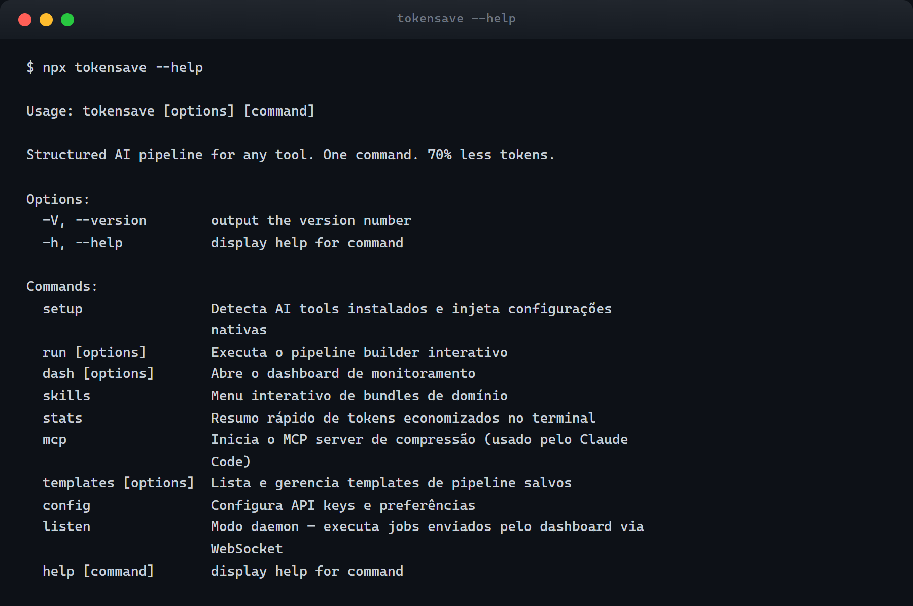
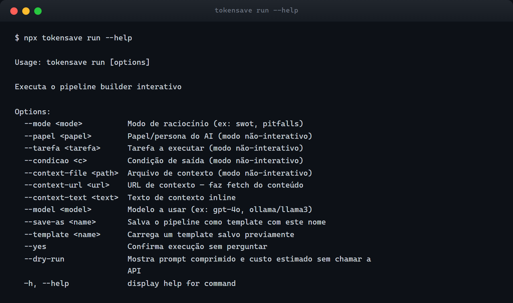
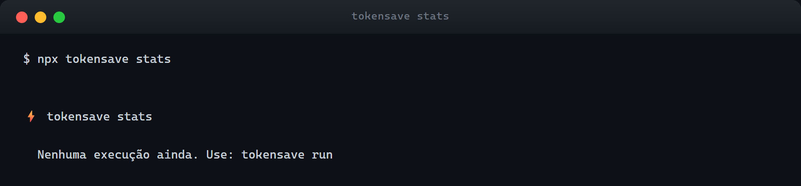
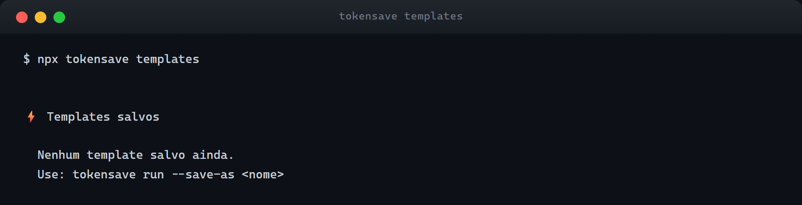
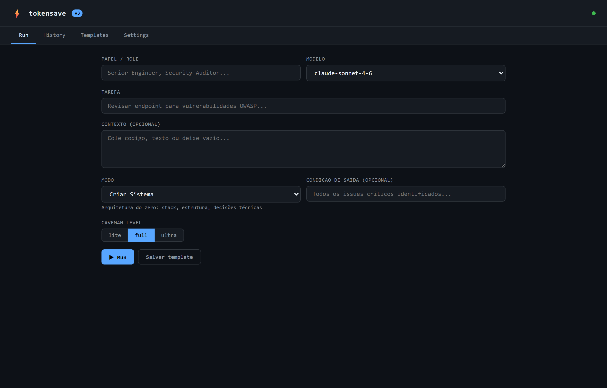
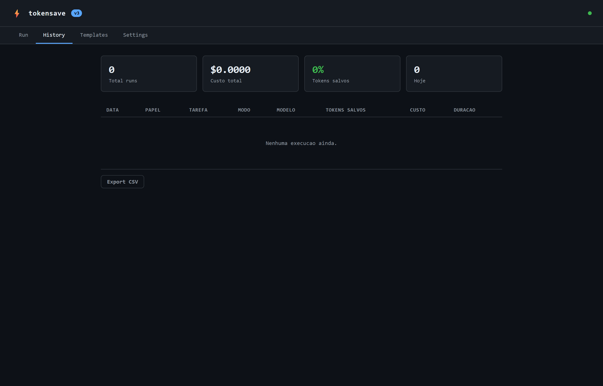
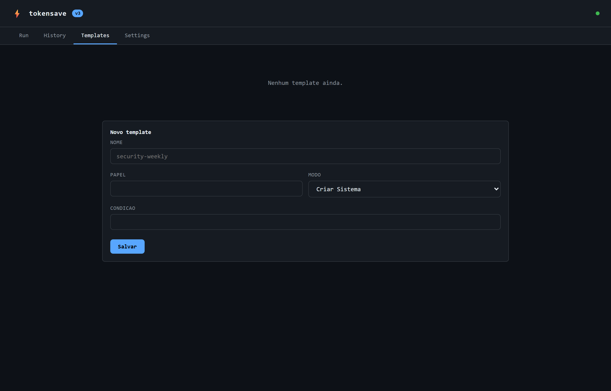
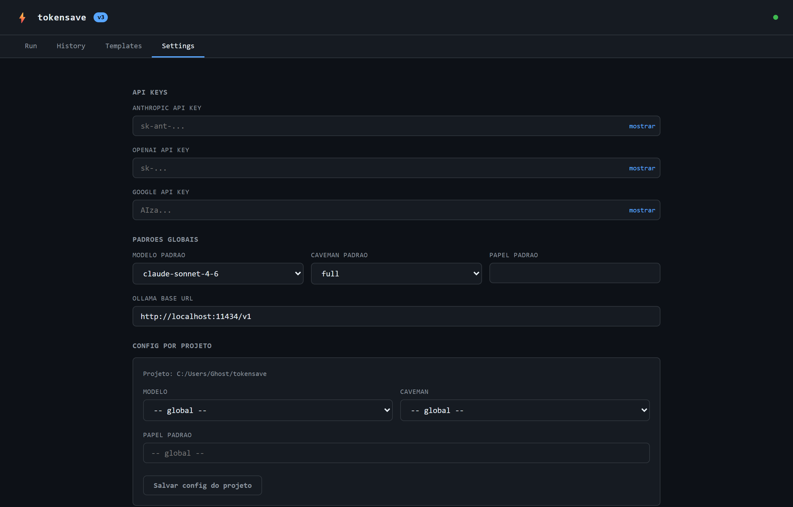

<div align="center">

# ⚡ tokensave

### Pipeline estruturado de AI. Um comando. 70% menos tokens.
### Structured AI pipeline for any tool. One command. 70% less tokens.

[](https://www.npmjs.com/package/tokensave)
[](LICENSE)
[](https://nodejs.org)
[](#testes--testing)
[](package.json)

</div>

---

> **PT** · [English below ↓](#english)

---

## PT — Português

tokensave é um CLI que envolve qualquer modelo de AI (Claude, GPT-4o, Gemini, Ollama) com um pipeline de compressão que remove ruído do seu contexto antes de chegar ao modelo — reduzindo o uso de tokens em 60–75% sem perder o que importa. Vem com 11 modos de raciocínio, dashboard web, gerenciamento de templates, daemon WebSocket e servidor MCP para integração nativa com o Claude Code.

### Índice

- [Funcionalidades](#funcionalidades)
- [Pré-requisitos](#pré-requisitos)
- [Início Rápido](#início-rápido)
- [Instalação](#instalação)
- [Comandos](#comandos)
- [Modos de Raciocínio](#modos-de-raciocínio)
- [Fontes de Contexto](#fontes-de-contexto)
- [Templates](#templates)
- [Dashboard Web](#dashboard-web)
- [Servidor MCP](#servidor-mcp)
- [Configuração](#configuração)
- [Arquitetura](#arquitetura)
- [Testes](#testes--testing)
- [Resolução de Problemas](#resolução-de-problemas)

---

### Funcionalidades

- **70% menos tokens** — pipeline de compressão dupla (headroom + caveman nativo) antes de cada chamada à API
- **11 modos de raciocínio** — prompts estruturados para revisão de código, SWOT, pitfalls, arquitetura, docs, comparação e mais
- **Modo não-interativo** — totalmente scriptável por flags; pipe do stdin; carrega múltiplos arquivos ou URLs
- **Dashboard web** — SPA de 4 abas em `localhost:7878`: disparar jobs, ver histórico, gerenciar templates, configurar
- **Daemon WebSocket** (`listen`) — mantém um worker rodando; dispara jobs do browser sem sair dele
- **Sistema de templates** — salva qualquer configuração de pipeline; roda novamente em um comando
- **Multi-provider** — Claude (Anthropic), GPT-4o (OpenAI), Gemini (Google), Ollama (local, grátis)
- **Servidor MCP** — integra a compressão diretamente no Claude Code como ferramenta nativa
- **Histórico SQLite** — cada execução salva automaticamente; exportar CSV pelo dashboard
- **--dry-run** — visualiza prompt comprimido e custo estimado antes de gastar um token

---

### Pré-requisitos

- **Node.js 18 ou superior** — verifique com `node --version`
- Pelo menos uma chave de API de provider:
  - Anthropic: [console.anthropic.com](https://console.anthropic.com)
  - OpenAI: [platform.openai.com](https://platform.openai.com)
  - Google AI: [aistudio.google.com](https://aistudio.google.com)
  - Ollama (grátis, local): [ollama.ai](https://ollama.ai) — sem chave necessária

---

### Início Rápido

```bash
# Interativo — guia você por cada etapa
npx tokensave run

# Revisão de código não-interativa em uma linha
npx tokensave run \
  --papel "Security Auditor" \
  --tarefa "Revisar endpoint de login" \
  --context-file ./src/api/auth.js \
  --mode revisar-codigo \
  --yes

# Visualizar tokens + custo sem chamar a API
npx tokensave run \
  --papel "Engineer" \
  --tarefa "Revisar auth" \
  --context-file ./src/auth.js \
  --mode revisar-codigo \
  --dry-run

# Abrir dashboard web
npx tokensave dash --web
```

---

### Instalação

**Sem instalar (npx):**
```bash
npx tokensave <comando>
```

**Instalação global:**
```bash
npm install -g tokensave
tokensave --version
```

**Clone local (desenvolvimento):**
```bash
git clone https://github.com/diegolial/tokensave.git
cd tokensave
npm install
node bin/tokensave.js run
```

**Configure sua chave de API:**
```bash
npx tokensave config
```

---

### Comandos

#### `run` — Executa um pipeline de AI

```
tokensave run [opções]
```

| Opção | Descrição | Exemplo |
|---|---|---|
| `--mode <modo>` | ID do modo de raciocínio | `--mode revisar-codigo` |
| `--papel <papel>` | Persona/papel do AI | `--papel "Security Auditor"` |
| `--tarefa <tarefa>` | Descrição da tarefa | `--tarefa "Encontrar SQL injection"` |
| `--condicao <c>` | Condição de saída | `--condicao "Todos os CVEs listados"` |
| `--context-file <path>` | Arquivo de contexto (repetível) | `--context-file src/auth.js` |
| `--context-url <url>` | URL para buscar como contexto | `--context-url https://exemplo.com/doc` |
| `--context-text <texto>` | Texto de contexto inline | `--context-text "function foo..."` |
| `--model <modelo>` | Sobrescreve modelo padrão | `--model gpt-4o` |
| `--template <nome>` | Carrega um template salvo | `--template security-audit` |
| `--save-as <nome>` | Salva pipeline como template | `--save-as security-audit` |
| `--yes` | Pula confirmação | |
| `--dry-run` | Mostra prompt comprimido + custo, sem chamar API | |

**Screenshots do CLI:**





**Modo não-interativo:**
```bash
npx tokensave run \
  --papel "Tech Lead" \
  --tarefa "Revisar PR por problemas de performance" \
  --context-file ./src/core/runner.js \
  --mode revisar-codigo \
  --yes
```

**Pipe do stdin:**
```bash
cat src/api/auth.js | npx tokensave run \
  --papel "Security Auditor" \
  --tarefa "Encontrar vulnerabilidades" \
  --mode revisar-codigo \
  --yes
```

**Múltiplos arquivos de contexto:**
```bash
npx tokensave run \
  --papel "Architect" \
  --tarefa "Documentar todos os módulos core" \
  --context-file src/core/runner.js \
  --context-file src/core/provider.js \
  --context-file src/core/metrics.js \
  --mode documentacao \
  --yes
```

**Dry-run:**
```bash
npx tokensave run \
  --papel "Engineer" \
  --tarefa "Revisar auth" \
  --context-file ./src/auth.js \
  --mode revisar-codigo \
  --dry-run

# ⚡ dry-run
#   Tokens originais:  1204
#   Após compressão:   361 (native, -70%)
#   Custo estimado:    $0.0012
```

---

#### `dash` — Dashboard web

```bash
npx tokensave dash --web
# Abre http://localhost:7878 no browser
```

---

#### `listen` — Daemon WebSocket

```bash
# Terminal 1: inicia o servidor do dashboard
npx tokensave dash --web

# Terminal 2: inicia o listener
npx tokensave listen
# ⚡ tokensave listen → ws://localhost:7878/ws
#   Aguardando jobs do dashboard. Ctrl+C para parar.
```

---

#### `stats` — Resumo de tokens economizados

```bash
npx tokensave stats
```



---

#### `templates` — Gerenciar templates

```bash
npx tokensave templates          # listar
npx tokensave templates --delete security-audit  # deletar
```



---

#### `config` — Configurar chaves e preferências

```bash
npx tokensave config
```

Modelos suportados: `claude-sonnet-4-6`, `claude-opus-4-7`, `claude-haiku-4-5`, `gpt-4o`, `gpt-4o-mini`, `gemini-1.5-pro`, `gemini-1.5-flash`, `ollama/llama3`

---

#### `setup` — Auto-detectar ferramentas de AI

```bash
npx tokensave setup
```

Escaneia Claude Code, Cursor, Copilot e outras ferramentas instaladas e injeta configurações nativas do tokensave.

---

#### `skills` — Menu de bundles de domínio

```bash
npx tokensave skills
```

---

#### `mcp` — Servidor MCP

```bash
npx tokensave mcp
```

---

### Modos de Raciocínio

| ID | Nome | Descrição | Nível Caveman |
|---|---|---|---|
| `criar-sistema` | Criar Sistema | Arquitetura do zero: stack, estrutura, decisões técnicas | full |
| `revisar-codigo` | Revisar Código | Bugs, segurança, qualidade, code smell | full |
| `documentacao` | Documentação | README, ADR, changelog, JSDoc, guias técnicos | lite |
| `consultor` | Consultor | ROI, risco, decisão estratégica como C-level | full |
| `swot` | SWOT | Análise estratégica: forças, fraquezas, oportunidades, ameaças | full |
| `compare` | Compare | Comparação A vs B com critérios explícitos | full |
| `multi-perspectiva` | Multi-perspectiva | Mesmo problema por 4 ângulos: dev, PM, usuário, ops | full |
| `parallel-lens` | Parallel Lens | 3 abordagens simultâneas — mostra todas sem escolher | ultra |
| `pitfalls` | Pitfalls | O que pode dar errado, armadilhas e edge cases | full |
| `metrics-mode` | Metrics Mode | Define e mede KPIs do que está sendo construído | full |
| `context-stack` | Context Stack | Empilha contexto progressivo sem explodir tokens | full |

**Níveis Caveman:**

| Nível | Efeito |
|---|---|
| `lite` | Preserva formatação e comentários; compressão leve |
| `full` | Remove prosa e comentários; mantém estrutura e lógica |
| `ultra` | Compressão máxima; só o esqueleto do código |

---

### Fontes de Contexto

| Fonte | Flag | Observação |
|---|---|---|
| Arquivo | `--context-file <path>` | Repetível para múltiplos arquivos |
| URL | `--context-url <url>` | Busca a página e remove tags HTML |
| Texto inline | `--context-text <texto>` | Passa string diretamente na linha de comando |
| Stdin pipe | `cat arquivo \| tokensave run ...` | Lê do stdin quando não é TTY |

Múltiplas fontes são concatenadas com `\n\n---\n\n` antes da compressão.

---

### Templates

Templates salvam uma configuração de pipeline (papel, modo, condição de saída) para reutilização.

```bash
# Salvar
npx tokensave run \
  --papel "Security Auditor" \
  --mode revisar-codigo \
  --condicao "Todos os CVEs identificados" \
  --tarefa "placeholder" \
  --save-as security-audit \
  --yes

# Reutilizar
npx tokensave run \
  --template security-audit \
  --tarefa "Revisar o novo endpoint OAuth" \
  --context-file ./src/api/oauth.js \
  --yes

# Listar / Deletar
npx tokensave templates
npx tokensave templates --delete security-audit
```

---

### Dashboard Web

```bash
npx tokensave dash --web
# http://localhost:7878
```

**Aba Run — dispara jobs visualmente:**



**Aba History — histórico completo com exportação CSV:**



**Aba Templates — gerencia templates pelo browser:**



**Aba Settings — configura chaves, modelo padrão, overrides por projeto:**



---

### Servidor MCP

```bash
# Iniciar
npx tokensave mcp

# Auto-configurar com Claude Code
npx tokensave setup
```

**Configuração manual** (`~/.claude/settings.json`):
```json
{
  "mcpServers": {
    "tokensave": {
      "command": "npx",
      "args": ["tokensave", "mcp"]
    }
  }
}
```

---

### Configuração

**Arquivo global** `~/.tokensave/config.json`:
```json
{
  "anthropic_api_key": "sk-ant-...",
  "openai_api_key": "sk-...",
  "google_api_key": "AIza...",
  "default_model": "claude-sonnet-4-6",
  "default_caveman": "full",
  "ollama_base_url": "http://localhost:11434/v1",
  "projects": {
    "/caminho/para/projeto": {
      "model": "gpt-4o",
      "caveman": "lite",
      "papel": "Senior Engineer"
    }
  }
}
```

**Variáveis de ambiente** (sobrescrevem o arquivo de config):

| Variável | Descrição |
|---|---|
| `ANTHROPIC_API_KEY` | Chave Anthropic |
| `OPENAI_API_KEY` | Chave OpenAI |
| `GOOGLE_API_KEY` | Chave Google |

**Tabela de preços dos modelos:**

| Modelo | Input / 1K tokens | Output / 1K tokens |
|---|---|---|
| claude-opus-4-7 | $0.015 | $0.075 |
| claude-sonnet-4-6 | $0.003 | $0.015 |
| claude-haiku-4-5 | $0.00025 | $0.00125 |
| gpt-4o | $0.0025 | $0.010 |
| gpt-4o-mini | $0.00015 | $0.0006 |
| gemini-1.5-pro | $0.00125 | $0.005 |
| gemini-1.5-flash | $0.000075 | $0.0003 |
| ollama/* | $0 | $0 |

---

### Arquitetura

```
tokensave/
├── bin/tokensave.js                  # entry point CLI
├── src/
│   ├── cli/
│   │   ├── index.js                  # Commander — todos os comandos registrados
│   │   └── commands/
│   │       ├── run.js                # interativo + não-interativo + dry-run
│   │       ├── dash.js               # abre dashboard
│   │       ├── listen.js             # daemon WebSocket
│   │       ├── stats.js              # resumo de tokens
│   │       ├── templates.js          # listar/deletar
│   │       ├── config.js             # configurar chaves
│   │       ├── setup.js              # detectar ferramentas AI
│   │       ├── skills.js             # menu de bundles
│   │       └── mcp.js                # servidor MCP
│   ├── core/
│   │   ├── config.js                 # lê/escreve ~/.tokensave/config.json
│   │   ├── validator.js              # valida parâmetros do pipeline
│   │   ├── provider.js               # detecta provider, cria cliente
│   │   ├── metrics.js                # tabela PRICING, custo, persistência SQLite
│   │   ├── streamer.js               # AsyncGenerator streaming de qualquer provider
│   │   ├── runner.js                 # runPipeline() — comprime → streama → salva
│   │   └── compressor/
│   │       ├── index.js              # facade compress()
│   │       ├── headroom.js           # mantém dentro do budget de tokens
│   │       └── native.js             # compressão caveman — remove prosa/comentários
│   ├── pipeline/
│   │   ├── builder.js                # wizard interativo (Inquirer)
│   │   └── modes/                    # 11 modos de raciocínio
│   ├── dashboard/web/
│   │   ├── server.js                 # Hono HTTP + WebSocket na mesma porta 7878
│   │   └── index.html                # SPA 4 abas (JS vanilla, tema escuro)
│   └── store/
│       ├── db.js                     # SQLite via better-sqlite3
│       └── templates.js              # CRUD de templates
└── tests/                            # 66 testes Vitest
```

**Fluxo de dados:**
```
tokensave run --papel "..." --tarefa "..." --context-file file.js --mode revisar-codigo --yes

  1. cli/commands/run.js
     ├── lê todas as fontes de contexto (arquivos, stdin, URL)
     └── monta objeto pipeline { papel, tarefa, contexto, modo, condicao, model }

  2. core/runner.js  runPipeline(pipeline)
     ├── validator.js   validatePipeline()    — campos obrigatórios, modo válido, modelo válido
     ├── config.js      getConfig()           — lê ~/.tokensave/config.json
     ├── provider.js    detectProvider()      — 'anthropic' | 'openai' | 'google' | 'ollama'
     │                  createClient()        — instancia cliente SDK
     ├── compressor/    compress(contexto)    → { text, originalTokens, compressedTokens, method }
     ├── monta systemPrompt com mode.systemPrompt + condicao
     ├── streamer.js    streamResponse()      — AsyncGenerator, yields chunks de texto
     └── metrics.js     saveRun()             — persiste no SQLite

  3. Chunks transmitidos para stdout em tempo real
```

---

### Resolução de Problemas

**Erro de chave de API:**
```bash
npx tokensave config
# ou
export ANTHROPIC_API_KEY=sk-ant-...
```

**`✗ Modelo inválido`:** O nome do modelo deve corresponder exatamente a um ID suportado. Rode `npx tokensave config` e selecione da lista.

**Dashboard com ponto cinza (WebSocket desconectado):** Servidor pode estar iniciando ainda. Recarregue após 1 segundo.

**Daemon `listen` não recebe jobs:** O servidor do dashboard deve estar rodando primeiro — `npx tokensave dash --web` em um terminal, depois `npx tokensave listen` em outro.

**Ollama — connection refused:** Certifique-se que o Ollama está rodando (`ollama serve`) e o modelo baixado (`ollama pull llama3`).

**`--context-file` não encontrado:** Caminhos são relativos ao diretório atual. Use caminhos absolutos se necessário.

---

---

<a name="english"></a>

## EN — English

tokensave is a CLI that wraps any AI model (Claude, GPT-4o, Gemini, Ollama) with a compression pipeline that strips noise from your context before it reaches the model — cutting token usage by 60–75% while preserving what matters. It ships 11 reasoning modes, a web dashboard, template management, a WebSocket daemon, and an MCP server for native Claude Code integration.

### Table of Contents

- [Key Features](#key-features)
- [Prerequisites](#prerequisites)
- [Quick Start](#quick-start)
- [Installation](#installation-1)
- [Commands](#commands-1)
- [Reasoning Modes](#reasoning-modes-1)
- [Context Sources](#context-sources-1)
- [Templates](#templates-1)
- [Web Dashboard](#web-dashboard-1)
- [MCP Server](#mcp-server-1)
- [Configuration](#configuration-1)
- [Architecture](#architecture-1)
- [Testing](#testes--testing)
- [Troubleshooting](#troubleshooting)

---

### Key Features

- **70% fewer tokens** — dual compression pipeline (headroom + native caveman) before every API call
- **11 reasoning modes** — structured prompts for code review, SWOT, pitfalls, architecture, docs, comparison, and more
- **Non-interactive mode** — fully scriptable via flags; pipe from stdin; load multiple files or URLs
- **Web dashboard** — 4-tab SPA at `localhost:7878`: dispatch jobs, view history, manage templates, configure settings
- **WebSocket daemon** (`listen`) — keep a terminal worker running; trigger jobs from the browser without leaving it
- **Template system** — save any pipeline config; rerun in one command
- **Multi-provider** — Claude (Anthropic), GPT-4o (OpenAI), Gemini (Google), Ollama (local, free)
- **MCP server** — plug tokensave compression directly into Claude Code as a native tool
- **SQLite history** — every run saved automatically; export CSV from the dashboard
- **--dry-run** — preview compressed prompt and estimated cost before spending a token

---

### Prerequisites

- **Node.js 18 or higher** — verify with `node --version`
- At least one AI provider API key:
  - Anthropic: [console.anthropic.com](https://console.anthropic.com)
  - OpenAI: [platform.openai.com](https://platform.openai.com)
  - Google AI: [aistudio.google.com](https://aistudio.google.com)
  - Ollama (free, local): [ollama.ai](https://ollama.ai) — no key needed

---

### Quick Start

```bash
# Interactive — guides you through every step
npx tokensave run

# Non-interactive code review in one line
npx tokensave run \
  --papel "Security Auditor" \
  --tarefa "Review this endpoint for vulnerabilities" \
  --context-file ./src/api/auth.js \
  --mode revisar-codigo \
  --yes

# Preview tokens + cost without calling the API
npx tokensave run \
  --papel "Engineer" \
  --tarefa "Review auth" \
  --context-file ./src/auth.js \
  --mode revisar-codigo \
  --dry-run

# Open web dashboard
npx tokensave dash --web
```

---

### Installation

**No install (npx):**
```bash
npx tokensave <command>
```

**Global install:**
```bash
npm install -g tokensave
tokensave --version
```

**Local dev clone:**
```bash
git clone https://github.com/diegolial/tokensave.git
cd tokensave
npm install
node bin/tokensave.js run
```

**Configure your API key:**
```bash
npx tokensave config
```

---

### Commands

#### `run` — Execute an AI pipeline

```
tokensave run [options]
```

| Option | Description | Example |
|---|---|---|
| `--mode <mode>` | Reasoning mode ID | `--mode revisar-codigo` |
| `--papel <role>` | AI persona / role | `--papel "Security Auditor"` |
| `--tarefa <task>` | Task description | `--tarefa "Find SQL injection"` |
| `--condicao <c>` | Exit condition | `--condicao "All CVEs listed"` |
| `--context-file <path>` | File as context (repeatable) | `--context-file src/auth.js` |
| `--context-url <url>` | URL to fetch as context | `--context-url https://example.com/docs` |
| `--context-text <text>` | Inline context string | `--context-text "function foo..."` |
| `--model <model>` | Override default model | `--model gpt-4o` |
| `--template <name>` | Load a saved template | `--template security-audit` |
| `--save-as <name>` | Save this pipeline as a template | `--save-as security-audit` |
| `--yes` | Skip confirmation prompt | |
| `--dry-run` | Show compressed prompt + cost, no API call | |

**Non-interactive mode:**
```bash
npx tokensave run \
  --papel "Tech Lead" \
  --tarefa "Review this PR for performance issues" \
  --context-file ./src/core/runner.js \
  --mode revisar-codigo \
  --yes
```

**Stdin pipe:**
```bash
cat src/api/auth.js | npx tokensave run \
  --papel "Security Auditor" \
  --tarefa "Find vulnerabilities" \
  --mode revisar-codigo \
  --yes
```

**Multiple context files:**
```bash
npx tokensave run \
  --papel "Architect" \
  --tarefa "Document all core modules" \
  --context-file src/core/runner.js \
  --context-file src/core/provider.js \
  --context-file src/core/metrics.js \
  --mode documentacao \
  --yes
```

**Dry-run:**
```bash
npx tokensave run \
  --papel "Engineer" \
  --tarefa "Review auth" \
  --context-file ./src/auth.js \
  --mode revisar-codigo \
  --dry-run

# ⚡ dry-run
#   Tokens originais:  1204
#   Após compressão:   361 (native, -70%)
#   Custo estimado:    $0.0012
```

---

#### `dash` — Web dashboard

```bash
npx tokensave dash --web
# Opens http://localhost:7878
```

---

#### `listen` — WebSocket daemon

```bash
# Terminal 1: start the dashboard server
npx tokensave dash --web

# Terminal 2: start the listener
npx tokensave listen
# ⚡ tokensave listen → ws://localhost:7878/ws
#   Waiting for jobs from dashboard. Ctrl+C to stop.
```

Each job dispatched from the browser's Run tab is routed to the listener, executed in-process, and its output streams back to the dashboard in real time.

---

#### `stats` — Token savings summary

```bash
npx tokensave stats
```

---

#### `templates` — Manage templates

```bash
npx tokensave templates                        # list
npx tokensave templates --delete security-audit  # delete
```

---

#### `config` — Configure keys and preferences

```bash
npx tokensave config
```

Supported models: `claude-sonnet-4-6`, `claude-opus-4-7`, `claude-haiku-4-5`, `gpt-4o`, `gpt-4o-mini`, `gemini-1.5-pro`, `gemini-1.5-flash`, `ollama/llama3`

---

#### `setup` — Auto-detect AI tools

```bash
npx tokensave setup
```

Scans for Claude Code, Cursor, GitHub Copilot and other installed tools, then writes their native config files to enable tokensave as an MCP provider.

---

#### `skills` — Domain bundle menu

```bash
npx tokensave skills
```

---

#### `mcp` — MCP server

```bash
npx tokensave mcp
```

---

### Reasoning Modes

| ID | Name | Description | Caveman Level |
|---|---|---|---|
| `criar-sistema` | Criar Sistema | Architecture from scratch: stack, structure, decisions | full |
| `revisar-codigo` | Revisar Código | Bugs, security, quality, code smell | full |
| `documentacao` | Documentação | README, ADR, changelog, JSDoc, technical guides | lite |
| `consultor` | Consultor | ROI, risk, strategic decision as C-level | full |
| `swot` | SWOT | Strategic analysis: strengths, weaknesses, opportunities, threats | full |
| `compare` | Compare | Structured A vs B comparison with explicit criteria | full |
| `multi-perspectiva` | Multi-perspectiva | Same problem from 4 angles: dev, PM, user, ops | full |
| `parallel-lens` | Parallel Lens | 3 simultaneous approaches — shows all without picking | ultra |
| `pitfalls` | Pitfalls | What can go wrong, traps, and edge cases | full |
| `metrics-mode` | Metrics Mode | Define and measure KPIs for what's being built | full |
| `context-stack` | Context Stack | Stack context progressively without exploding tokens | full |

**Caveman levels:**

| Level | Effect |
|---|---|
| `lite` | Preserve most formatting and comments; light compression |
| `full` | Strip prose and comments; keep structure and logic |
| `ultra` | Maximum compression; code skeleton only |

---

### Context Sources

| Source | Flag | Notes |
|---|---|---|
| File | `--context-file <path>` | Repeatable for multiple files |
| URL | `--context-url <url>` | Fetches page and strips HTML tags |
| Inline text | `--context-text <text>` | Pass string directly on the command line |
| Stdin pipe | `cat file \| tokensave run ...` | Reads from stdin when not a TTY |

Multiple sources are joined with `\n\n---\n\n` separators before compression.

---

### Templates

Templates save a pipeline configuration (role, mode, exit condition) so you can rerun with one flag.

```bash
# Save
npx tokensave run \
  --papel "Security Auditor" \
  --mode revisar-codigo \
  --condicao "All CVEs identified" \
  --tarefa "placeholder" \
  --save-as security-audit \
  --yes

# Reuse
npx tokensave run \
  --template security-audit \
  --tarefa "Review the new OAuth endpoint" \
  --context-file ./src/api/oauth.js \
  --yes

# List / Delete
npx tokensave templates
npx tokensave templates --delete security-audit
```

---

### Web Dashboard

```bash
npx tokensave dash --web
# http://localhost:7878
```

**Run tab — build and dispatch a pipeline visually:**


**History tab — full run history with CSV export:**


**Templates tab — manage templates from the browser:**


**Settings tab — configure keys, default model, per-project overrides:**


---

### MCP Server

```bash
# Start the server
npx tokensave mcp

# Auto-configure with Claude Code
npx tokensave setup
```

**Manual Claude Code config** (`~/.claude/settings.json`):
```json
{
  "mcpServers": {
    "tokensave": {
      "command": "npx",
      "args": ["tokensave", "mcp"]
    }
  }
}
```

---

### Configuration

**Global config file** `~/.tokensave/config.json`:
```json
{
  "anthropic_api_key": "sk-ant-...",
  "openai_api_key": "sk-...",
  "google_api_key": "AIza...",
  "default_model": "claude-sonnet-4-6",
  "default_caveman": "full",
  "ollama_base_url": "http://localhost:11434/v1",
  "projects": {
    "/path/to/project": {
      "model": "gpt-4o",
      "caveman": "lite",
      "papel": "Senior Engineer"
    }
  }
}
```

**Environment variables** (override config file):

| Variable | Description |
|---|---|
| `ANTHROPIC_API_KEY` | Anthropic key |
| `OPENAI_API_KEY` | OpenAI key |
| `GOOGLE_API_KEY` | Google key |

**Model pricing:**

| Model | Input / 1K tokens | Output / 1K tokens |
|---|---|---|
| claude-opus-4-7 | $0.015 | $0.075 |
| claude-sonnet-4-6 | $0.003 | $0.015 |
| claude-haiku-4-5 | $0.00025 | $0.00125 |
| gpt-4o | $0.0025 | $0.010 |
| gpt-4o-mini | $0.00015 | $0.0006 |
| gemini-1.5-pro | $0.00125 | $0.005 |
| gemini-1.5-flash | $0.000075 | $0.0003 |
| ollama/* | $0 | $0 |

---

### Architecture

```
tokensave/
├── bin/tokensave.js                  # CLI entry point
├── src/
│   ├── cli/
│   │   ├── index.js                  # Commander — all commands registered here
│   │   └── commands/                 # one file per command
│   ├── core/
│   │   ├── config.js                 # read/write ~/.tokensave/config.json
│   │   ├── validator.js              # validate pipeline params + model names
│   │   ├── provider.js               # detect provider, create API client
│   │   ├── metrics.js                # PRICING table, cost estimation, SQLite persistence
│   │   ├── streamer.js               # AsyncGenerator streaming from any provider
│   │   ├── runner.js                 # runPipeline() — compress → stream → save
│   │   └── compressor/               # headroom.js + native.js facade
│   ├── pipeline/
│   │   ├── builder.js                # interactive CLI wizard (Inquirer)
│   │   └── modes/                    # 11 reasoning modes (system prompts)
│   ├── dashboard/web/
│   │   ├── server.js                 # Hono HTTP + WebSocket on same port 7878
│   │   └── index.html                # 4-tab SPA (vanilla JS, dark theme)
│   └── store/
│       ├── db.js                     # SQLite via better-sqlite3
│       └── templates.js              # template CRUD
└── tests/                            # 66 Vitest tests
```

**Data flow:**
```
tokensave run --papel "..." --tarefa "..." --context-file file.js --mode revisar-codigo --yes

  1. cli/commands/run.js
     ├── reads all context sources (files, stdin, URL)
     └── builds pipeline object { papel, tarefa, contexto, modo, condicao, model }

  2. core/runner.js  runPipeline(pipeline)
     ├── validator.js   validatePipeline()
     ├── config.js      getConfig()
     ├── provider.js    detectProvider() → createClient()
     ├── compressor/    compress(contexto) → { text, originalTokens, compressedTokens, method }
     ├── builds systemPrompt from mode.systemPrompt + condicao
     ├── streamer.js    streamResponse() — AsyncGenerator, yields text chunks
     └── metrics.js     saveRun() — persists to SQLite

  3. Chunks streamed to stdout in real time
```

---

### Testes / Testing

```bash
# Rodar todos os testes / Run all tests (66)
npm test

# Watch mode
npm run test:watch

# Arquivo específico / Specific file
npx vitest run tests/core/runner.test.js

# Por padrão de nome / By name pattern
npx vitest run -t "streams output"
```

Não são necessárias chaves de API para rodar os testes — todos os providers são mockados via `vi.mock()`.

No API keys required to run the test suite — all providers are mocked via `vi.mock()`.

---

### Troubleshooting

**API key error:** Run `npx tokensave config` or set `ANTHROPIC_API_KEY` / `OPENAI_API_KEY` / `GOOGLE_API_KEY` as environment variables.

**`✗ Modelo inválido`:** Model name must exactly match a supported ID. Run `npx tokensave config` to select from the list.

**Dashboard grey dot (WebSocket disconnected):** Server may still be booting. Reload after 1 second. Make sure `npx tokensave dash --web` is running.

**`listen` receives no jobs:** Dashboard server must be running first — `npx tokensave dash --web` in one terminal, then `npx tokensave listen` in another.

**Ollama connection refused:** Ensure Ollama is running (`ollama serve`) and the model is pulled (`ollama pull llama3`). Default URL is `http://localhost:11434/v1`.

**`--context-file` not found:** Paths are resolved relative to the current working directory. Use absolute paths if running from a different directory.

**Stats show 0 runs:** SQLite database at `~/.tokensave/runs.db` is created on first run. Execute any `tokensave run` to create it.

---

## License / Licença

MIT
